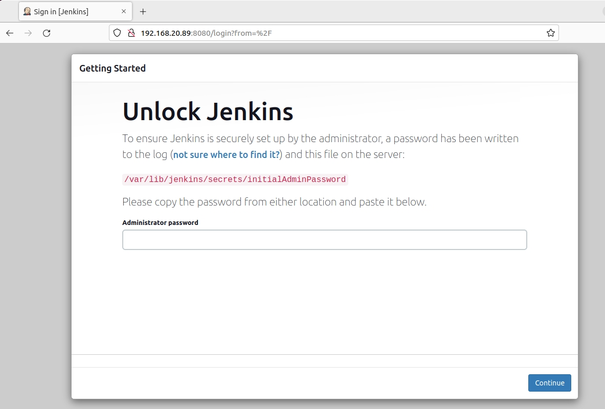
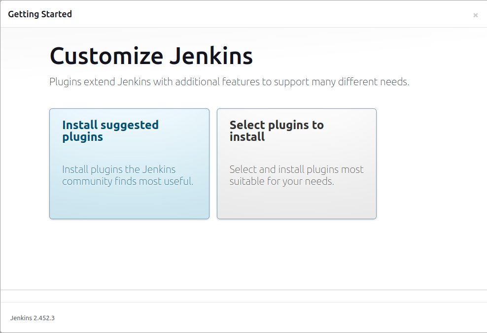
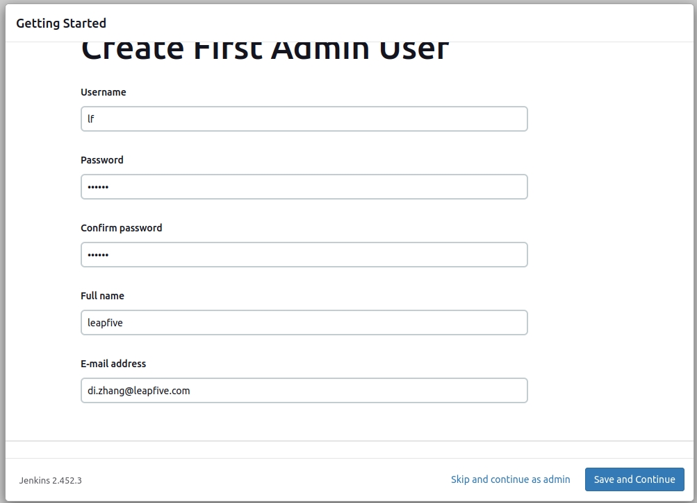
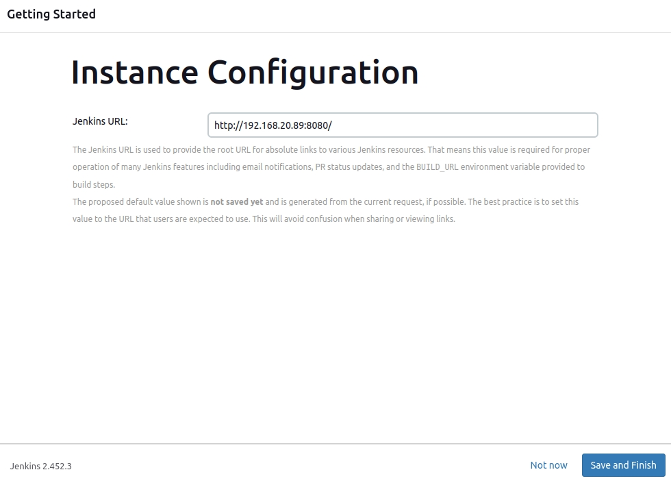
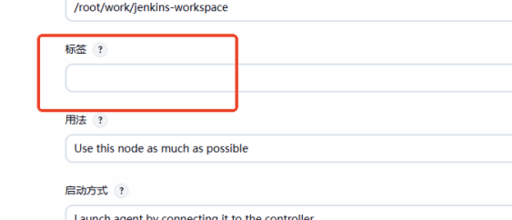
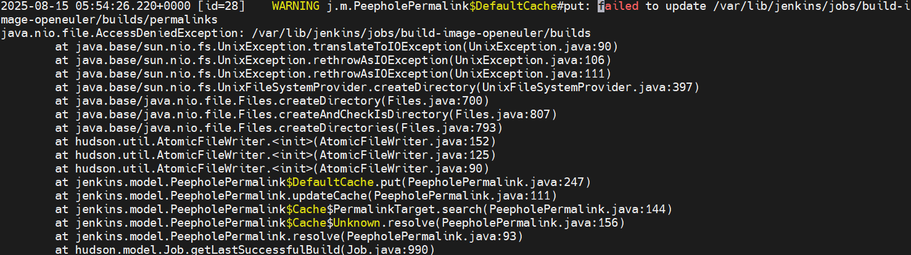
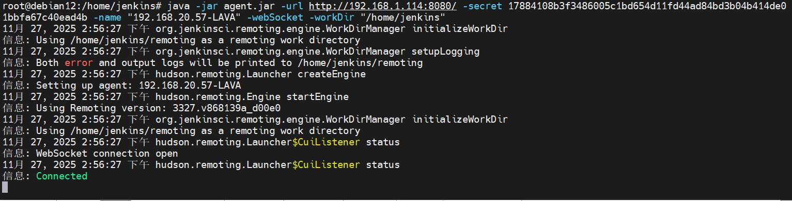

# 安装
## 说明 
Jenkins需要Java才能运行。并非所有Linux发行版默认都包含Java，且某些Java版本可能与Jenkins不兼容。

参考文档：https://get.jenkins.io/opensuse-stable/

## 添加Jenkins仓库
```bash
zypper addrepo -f https://pkg.jenkins.io/opensuse/ jenkins
```
## 安装相关依赖

```bash
zypper install dejavu-fonts fontconfig java-17-openjdk
```

## 安装Jenkins

````bash
zypper install jenkins
````

## 查看是否安装成功
查看服务，启动表示成功

    sudo systemctl status jenkins


## 设置Jenkins服务
启动 Jenkins 服务并设置为开机自启

```bash
systemctl start jenkins
systemctl enable jenkins
```
如出现无法设置开机自启：
```bash
Synchronizing state of jenkins.service with SysV service script with /usr/lib/systemd/systemd-sysv-install.
Executing: /usr/lib/systemd/systemd-sysv-install enable jenkins
Failed to execute /usr/lib/systemd/systemd-sysv-install: No such file or directory
```

确认服务存在
```bash
ls /usr/lib/systemd/system/jenkins.service
```
启用
```bash
systemctl enable /usr/lib/systemd/system/jenkins.service
```

## 防火墙设置
Jenkins 默认运行在 8080 端口，需确保防火墙允许

    sudo ufw allow 8080
    sudo ufw status
## 访问Jenkins
在浏览器中输入**http://192.168.1.114:8080**，其中IP地址为虚拟机的IP，即可访问

**获得密码**

    sudo cat /var/lib/jenkins/secrets/initialAdminPassword

填入然后Continue

**自定义Jenkins**

选择推荐即可



**初始管理员**

初始账号密码都是`admin`



**URL**


# 常见操作


## 导入Job

将.xml任务导入到Jenkins主机。

### 确认`JENKINS_HOME`

```bash
vim /etc/sysconfig/jenkins
```
一般是`/var/lib/jenkins`。

### 创建新任务目录

```bash
mkdir -p /var/lib/jenkins/jobs/newjobname
```
### 将XML 配置文件复制到新创建的任务目录中

```bash
cp /path/to/your/config.xml /var/lib/jenkins/jobs/newjobname/config.xml
```

### 修改权限
将job目录权限给Jenkins用户，不然后期从页面删除项目会报错。
```bash
chown -R jenkins:jenkins /var/lib/jenkins/jobs/
```

然后`重新加载Jenkins`即可。至此，Job建立好了，但可能需要重新配置一些参数，例如Agent标签等。如果没有Agent还需要添加Agent。

## 重新加载 Jenkins 配置

###    UI方式

Jenkins UI中，点击右上角的 "Manage Jenkins"，然后点击 "Reload Configuration from Disk"。

###    命令行

下载jenkins-cli.jar
```bash
wget http://192.168.1.114:8080/jnlpJars/jenkins-cli.jar
```
执行 Jenkins CLI 操作,重载配置

```bash
java -jar /path/to/jenkins-cli.jar -s http://192.168.1.114:8080 -auth admin:admin reload-configuration
```

## 添加Agent


Agent是连接到Jenkins的节点（一般是另一台机器），用于执行具体的任务。

###    配置节点

限制项目的运行节点必须存在，以riscv64为例（  <assignedNode>riscv64</assignedNode>），表示构建任务需在标签为riscv64的节点执行。
进入 Jenkins → “Manage Jenkins” → “Nodes” → “New Node” → “Permanent Agent” （填入riscv64）

其中名称可以自定义；Remote directory is mandatory，就是该节点的工作目录，一般是：`/var/lib/jenkins`，没有则在Agent上创建（制作rootfs和镜像，Agent建议直接用root用户创建；其他普通任务才配置jenkins用户权限，可参考“[agent上创建jenkins用户及工作目录](#agent上创建jenkins用户及工作目录)”）。

标签就是xml中`<assignedNode>`标签的内容。



###    确保新节点为在线状态
但此时节点仍未和Master（Jenkins 主服务）连接上：


点击节点名，进入`Agent riscv64`配置界面


先创建并进入之前配置的`Remote directory is mandatory`，然后按系统类型，执行页面上的命令。比如Linux中：

```bash
mkdir -p /root/work/jenkins-workspace
cd /root/work/jenkins-workspace

curl -sO http://192.168.1.114:8080/jnlpJars/agent.jar
java -jar agent.jar -url http://192.168.1.114:8080/ -secret a49bdb2ff2f852078c45ddc90945ae1373f8f8498ef4f40ce57fa915c1534e99 -name riscv64 -webSocket -workDir "/root/work/jenkins-workspace"
```


Tips：
`/var/log/jenkins/jenkins.log`为Jenkins的日志。遇到问题可以跟踪这个日志。调试完成后记得把日志关了，否则会很大。
修改`/usr/lib/systemd/system/jenkins.service`的第50行，注释掉，就可以关闭日志。

## Agent上创建jenkins用户及工作目录

如果是制作rootfs和镜像，Agent建议直接给root权限，其他行为才配置jenkins用户权限。

### 创建jenkins用户

```bash
useradd \
  --system \
  --home /home/jenkins \
  --shell /bin/false \
  --comment "Jenkins Automation User" \
  -m  \
  jenkins
```

### 创建并授权 Agent 工作目录

```bash
chown jenkins:jenkins /home/jenkins
chmod 755 /home/jenkins
```

##    配置上下游关联的Job

以时间戳`timetag`参数为例，采用

###    准备Plugin

Jenkins → Manage Jenkins → Manage Plugins → Available → Search → Parameterized Trigger → Install and 重启Jenkins

###    上游 Job 配置
1、在 Shell Builder 中：

```bash
export timetag=$(date +%Y%m%d%H%M)

# 可选：输出日志确认
echo "Generated timetag: $timetag"
```
2、把 timetag 定义为 参数：

General → 构建参数 → 添加 String Parameter → `Name:timetag；默认值: 可留空或 1`

3、添加 Parameterized Trigger 触发下游：

构建后操作 → Trigger parameterized build on other projects → Projects to build：`下游Job名1, 下游Job名2` → 选择触发条件 → Add parameters：选择参数传递方式，如`Current build parameters`

使用 Current Build Parameters，Jenkins 会自动把上游 Job 的参数（这里是 timetag）传递给下游。


###    下游 Job 配置
1、把 timetag 定义为 参数：

General → 构建参数 → 添加 String Parameter → `Name:timetag；默认值: 留空(继承上游参数时，一定需要设置为空)`


#   问题处理

##    问题及错误

访问异常拒绝



通常是目录文件不存在或者进程用户权限问题。

## 插件管理报错
打开插件管理有如下错误：

    There were errors checking the update sites: UnknownHostException: updates.jenkins.io
或者安装插件出现如下报错：

    Failed to resolve host name updates.jenkins.io. Perhaps you need to configure HTTP proxy?
    java.net.UnknownHostException: updates.jenkins.io
	at java.base/sun.nio.ch.NioSocketImpl.connect(NioSocketImpl.java:572)
	at java.base/java.net.Socket.connect(Socket.java:633)
	at java.base/sun.net.NetworkClient.doConnect(NetworkClient.java:178)
	at java.base/sun.net.www.http.HttpClient.openServer(HttpClient.java:533)
	at java.base/sun.net.www.http.HttpClient.openServer(HttpClient.java:638)
	at java.base/sun.net.www.http.HttpClient.<init>(HttpClient.java:281)
	at java.base/sun.net.www.http.HttpClient.New(HttpClient.java:386)
	at java.base/sun.net.www.http.HttpClient.New(HttpClient.java:408)
	at java.base/sun.net.www.protocol.http.HttpURLConnection.getNewHttpClient(HttpURLConnection.java:1308)
	at java.base/sun.net.www.protocol.http.HttpURLConnection.plainConnect0(HttpURLConnection.java:1241)
	at java.base/sun.net.www.protocol.http.HttpURLConnection.plainConnect(HttpURLConnection.java:1127)
	at java.base/sun.net.www.protocol.http.HttpURLConnection.connect(HttpURLConnection.java:1056)
	at java.base/sun.net.www.protocol.http.HttpURLConnection.getInputStream0(HttpURLConnection.java:1686)
	at java.base/sun.net.www.protocol.http.HttpURLConnection.getInputStream(HttpURLConnection.java:1610)
	at java.base/java.net.HttpURLConnection.getResponseCode(HttpURLConnection.java:529)
	at hudson.model.UpdateCenter$UpdateCenterConfiguration.testConnection(UpdateCenter.java:1452)
	at hudson.model.UpdateCenter$UpdateCenterConfiguration.checkUpdateCenter(UpdateCenter.java:1223)
	at hudson.model.UpdateCenter$ConnectionCheckJob.run(UpdateCenter.java:1686)
	at java.base/java.util.concurrent.Executors$RunnableAdapter.call(Executors.java:539)
	at java.base/java.util.concurrent.FutureTask.run(FutureTask.java:264)
	at hudson.remoting.AtmostOneThreadExecutor$Worker.run(AtmostOneThreadExecutor.java:121)
	at java.base/java.lang.Thread.run(Thread.java:840)
    
原因及解决办法：

原因：无法解析 updates.jenkins.io 的主机名，通常是 DNS 配置问题
解决步骤：
    
1：检查是否有符号链接或其他服务管理 /etc/resolv.conf 文件
 ```bash
    ls -l /etc/resolv.conf
 ```
2：若无，直接修改 /etc/resolv.conf 文件
```bash    
vim /etc/resolv.conf

添加新的DNS：

nameserver 8.8.8.8
nameserver 114.114.114.114
```
3：若存在符号链接,例如：

```bash  
lrwxrwxrwx 1 root root 39  8月  7 11:30 /etc/resolv.conf -> ../run/systemd/resolve/stub-resolv.conf

修改 systemd-resolved 配置：

sudo nano /etc/systemd/resolved.conf

在 [Resolve] 部分下添加：

DNS=8.8.8.8 114.114.114.114
```
4：重启服务
```bash 
sudo systemctl restart systemd-resolved
```
5：查看是否运行
```bash
    resolvectl status
``` 

##  WebSocket Agent 方式占用终端

情况：Agent上使用 WebSocket Agent 方式链接到Jenkins 时，需要没有开机后手动执行，且会占用终端，导致无法执行命令。



解决方法：将 Agent 作为系统服务运行（systemd）。

1、创建 systemd 服务文件

```bash
vim /etc/systemd/system/jenkins-agent.service
```
2、填入以下内容：

```bash
[Unit]
Description=Jenkins Agent connect to Jenkins.
After=network.target

[Service]
Type=simple
User=jenkins
WorkingDirectory=/home/jenkins
#
#The "-secret" is from Jenkins host.
ExecStart=/usr/bin/java -jar /home/jenkins/agent.jar -url http://192.168.1.114:8080/ -secret 17884108b3f3486005c1bd654d11fd44ad84bd3b04b414de01bbfa67c40ead4b -name "192.168.20.57-LAVA" -webSocket -workDir "/home/jenkins"
Restart=always
RestartSec=10

[Install]
WantedBy=multi-user.target
```

Tips:
*	确保 agent.jar 已下载到 /home/jenkins/agent.jar
*	Java 路径必须为绝对路径，可通过 which java 确认，一般是 /usr/bin/java 

3、重载 systemd 并启用服务

```bash
systemctl daemon-reexec
systemctl daemon-reload
systemctl enable jenkins-agent
systemctl start jenkins-agent
```

systemd 启动 Jenkins Agent（agent.jar）时
*	`整个 Agent 进程`都是以 jenkins 用户身份运行。Agent 本身的行为完全属于 User= 指定的用户。

在 Agent 上执行 Job，Jenkins Controller 下发 Job 到 Agent 时：

*	Job 进程默认 继承 Agent 进程的用户，Job 的执行用户 = Agent 进程的用户。