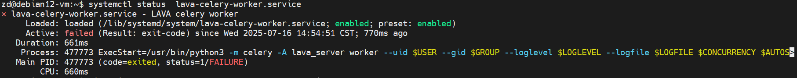
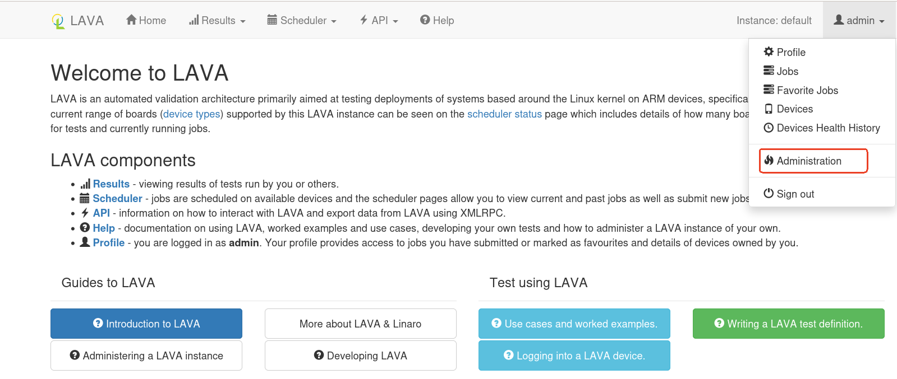
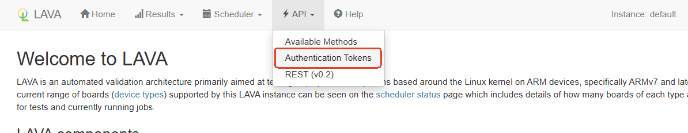

#   LAVA 

ALL Reference Documentation：[overview](https://docs.lavasoftware.org/lava/contents.html)

#   First steps installing LAVA

Reference Documentation：[First steps installing LAVA](https://docs.lavasoftware.org/lava/contents.html#contents-first-steps-installing)

##   Installing on a Debian system

### 1、First install the Debian 12 system 

### 2、Add LAVA's key to the system:

```bash
 $ sudo apt install curl gpg
# Download Key    
 $ curl -fsSL "https://apt.lavasoftware.org/lavasoftware.key.asc" | gpg --dearmor > lavasoftware.gpg
 $ sudo mv lavasoftware.gpg /usr/share/keyrings
 $ sudo chmod u=rw,g=r,o=r /usr/share/keyrings/lavasoftware.gpg
```
### 3、Add LAVA software repository

```bash
$ echo 'deb [signed-by=/usr/share/keyrings/lavasoftware.gpg] https://apt.lavasoftware.org/release bookworm main' | sudo tee /etc/apt/sources.list.d/lavasoftware.list
# After that step, run apt update again to locate the required dependencies
$ sudo apt update
```
3、Install LAVA Server(Production releases)

```bash
$ sudo apt install postgresql
$ sudo apt install lava-server
# When finish the installation, need to enable the services
$ sudo systemctl enable lava-server-gunicorn.service --now
$ sudo systemctl enable lava-worker --now
$ sudo systemctl enable lava-celery-worker.service --now 
$ sudo systemctl enable lava-publisher.service --now 
$ sudo systemctl enable lava-coordinator.service --now 
$ sudo systemctl enable lava-scheduler.service --now
```

Tips:
`lava-celery-worker.service` failed to start,  possibly due to log file permission issues.



The `/var/log/lava-server/` directory is owned by `root`, but `lava-celery-worker.service` runs as the `lavaserver` user. As a result, it does not have permission to create or write to log files .

```bash
$ sudo journalctl -u lava-celery-worker.service -b --no-pager
```


So, create `/var/log/lava-server/lava-celery-worker.log` and set its ownership to the `lavaserver` user.

```bash
$ sudo touch /var/log/lava-server/lava-celery-worker.log
$ sudo chown lavaserver:lavaserver /var/log/lava-server/lava-celery-worker.log
$ sudo chmod 644 /var/log/lava-server/lava-celery-worker.log
```

### 4、Add SuperUser
```bash
# Add a normal user 
$ sudo lava-server manage users add <username>  --passwd <password>
# Set this user as a superuser
$ sudo lava-server manage authorize_superuser --username {username}
```

### 5、Installation Verification
When LAVA is installed, execute the follow command can check the installation status:
```bash
$ lava-server manage check --deploy
```
Error is red, warning is yellow.

By default (for versions older than 2020.5), LAVA will create /etc/lava-server/lava-server.conf with the following content:

```bash
SECURE_CONTENT_TYPE_NOSNIFF = True
SECURE_BROWSER_XSS_FILTER = True
SESSION_COOKIE_SECURE = True
CSRF_COOKIE_SECURE = True
CSRF_COOKIE_HTTPONLY = True
X_FRAME_OPTIONS = 'DENY'
```
For versions later than 2020.5, LAVA automatically sets these parameters implicitly.
If you need to modify them, please create the configuration file manually.

##      Enable HTTPS

After completing the above steps, you can usually successfully access the page through localhost. It should be noted that if you access it through IP or domain name without enabling HTTPS, login failure may occur due to security restrictions; in addition, LAVA also strongly recommends enabling HTTPS in production environments.

So, please modify the configuration by those steps:

1、Generate a private key and corresponding self-signed certificate

```bash
$ openssl req -x509 -nodes -days 3650 -newkey rsa:2048 \
  -keyout /etc/ssl/private/apache-selfsigned.key \
  -out /etc/ssl/certs/apache-selfsigned.crt \
  -subj "/CN=lava.leapfive.com" \
  -addext "subjectAltName=DNS:lava.leapfive.com,DNS:localhost,IP:192.168.20.57" \
  -addext "basicConstraints=CA:FALSE" \
  -addext "keyUsage=critical,digitalSignature,keyEncipherment" \
  -addext "extendedKeyUsage=serverAuth"
```

2、Modify the configuration file: `/etc/apache2/sites-available/lava-server.conf`


The full text is as follows:
```bash
#NameVirtualHost 127.0.0.1:80
#<VirtualHost lava-server:80>
<VirtualHost *:80>
    ServerAdmin webmaster@localhost

    Alias /tmp/ /var/lib/lava/dispatcher/tmp/

    # Let apache2 handle these URIs
    ProxyPass /tmp !
    # Send web socket requests to lava-publisher
    ProxyPass /ws/ ws://127.0.0.1:8001/ws/
    ProxyPassReverse /ws/ ws://127.0.0.1:8001/ws/
    # Send request to Gunicorn
    ProxyPass / http://127.0.0.1:8000/
    ProxyPassReverse / http://127.0.0.1:8000/
    ProxyPreserveHost On

    DocumentRoot /usr/share/lava-server/static/lava_server/

    <Directory /var/lib/lava/dispatcher/tmp>
        Options -Indexes
        Require all granted
        AllowOverride None
        <IfModule mod_php7.c>
            php_admin_flag engine Off
        </IfModule>
    </Directory>

    LogLevel info
    ErrorLog ${APACHE_LOG_DIR}/lava-server.log
    CustomLog ${APACHE_LOG_DIR}/lava-server.log combined
</VirtualHost>

<VirtualHost *:443>
    ServerAdmin webmaster@localhost

    # 网站域名
    ServerName lava.leapfive.com

    #  允许IP 登录
    ServerAlias 192.168.20.57

    SSLEngine on
    SSLCertificateFile      /etc/ssl/certs/apache-selfsigned.crt
    SSLCertificateKeyFile   /etc/ssl/private/apache-selfsigned.key

    # ------------ 反向代理核心配置 ---------------
    ProxyPreserveHost On
    RequestHeader set X-Forwarded-Proto "https"

    # 防止 cookie domain/path 出错
    ProxyPassReverseCookieDomain 127.0.0.1 lava.leapfive.com
    ProxyPassReverseCookiePath / /

    # /tmp 目录不走代理
    Alias /tmp/ /var/lib/lava/dispatcher/tmp/
    ProxyPass /tmp/ !

    # Websocket for lava-publisher
    ProxyPass /ws/ ws://127.0.0.1:8001/ws/
    ProxyPassReverse /ws/ ws://127.0.0.1:8001/ws/

    # RPC WebSocket
    ProxyPassMatch "^/rpc/.*" ws://127.0.0.1:8001/

    # RPC2 endpoint for lavacli
    ProxyPass /RPC2 http://127.0.0.1:8000/RPC2
    ProxyPassReverse /RPC2 http://127.0.0.1:8000/RPC2

    # proxy to gunicorn (LAVA web UI)
    ProxyPass / http://127.0.0.1:8000/
    ProxyPassReverse / http://127.0.0.1:8000/

    # 静态文件
    DocumentRoot /usr/share/lava-server/static/lava_server/

    <Directory /var/lib/lava/dispatcher/tmp>
        Options -Indexes
        Require all granted
        AllowOverride None
    </Directory>

    ErrorLog ${APACHE_LOG_DIR}/lava-server-error.log
    CustomLog ${APACHE_LOG_DIR}/lava-server-access.log combined
</VirtualHost>
```
3、Modify /etc/hosts

add：

```bash
192.168.20.57   lava.leapfive.com
```
4、Restart the service

```bash
$ sudo a2enmod ssl
$ sudo a2enmod headers
$ sudo systemctl restart apache2
```

##  lavacli
### Installing lavacli

```bash
$ sudo apt update
$ sudo apt install lavacli
```

### Using lavacli submit lava jobs

First, you need to create a token, [Reference Documentation:Authentication Tokens](https://docs.lavasoftware.org/lava/first_steps.html#authentication-tokens)

`LAVA officially advises not to execute lavacli-related commands as "root" or with "sudo".
Run lavacli as your normal username(eg: debian12).`

```bash
$ su - debian12
# Add the token to the identity configuration of lavacli.
$ lavacli identities add --token <TOKEN> --uri https://validation.linaro.org/RPC2 --username <USERNAME> production

$ lavacli identities list
Identities:
* production

# submit LAVA test jobs (It is necessary to configure device types, devices, and other related settings first; otherwise, an error will occur.)
$ lavacli -i production jobs submit /path/to/you/lavajob.yaml
1865811
```
* `TOKEN`: The token generated on the webpage in the previous step.
* `USERNAME`: The login account in the LAVA system.
* `production`: The label for this token.

##      Adding your first devices

Tips:
Prior to adding any devices, admins should add suitable device types to the database. 


* Ensure a Jinja2 template file exists in the directory:`/etc/lava-server/dispatcher-config/device-types/`


* If a suitable template file does not exist in that directory, you will need to create a new one. The filename (without the .jinja2 extension) must exactly match the device type name you plan to add.


### Add the device type 

Device types can be added via command line or web user interface. Here we use the Web UI.

Click on your username(admin/admin), then go to "Administration → LAVA_SCHEDULER_APP → Device types".



The only value needed for the QEMU device type is the Name(e.g:`qemu-amd64`), just check that Display is the default: enabled. Now Save.

### Add the first device 
 
 The fields that need to be filled in are as follows:

* Hostname: the hostname of the device, e.g: `qemu-amd64-node01`
* Device type: the name of the device type you just created
* Worker Host: controller host name (If the Master and Worker are on the same machine, just use the machine's hostname.)
* Health: Good or unknown


Next, create the file `qemu-amd64-node01.jinja2` and place it in `/etc/lava-server/dispatcher-config/devices/` directory. The content is as follows:

```bash



```
Tips:
If LAVA is running in a virturn machine, add `` the end of  `qemu-amd64-node01.jinja2` .

##  Preparations before the first task

Before adding the first task, log in to the homepage as an administrator, go to `API → Authentication Tokens → new`, and create a token. This token will be used in many later operations.



##  The first task

### Web UI 
The first task's configuration file, `job.yml`, can be submitted through the command line or the web UI. Here, we use Web UI to add a task.

Go to the homepage, click on `Scheduler → Submit`, and need to add context as fellow:

```bash
# Your first LAVA JOB definition for an x86_64 QEMU
device_type: qemu-amd64
job_name: QEMU pipeline, first job
timeouts:
  job:
    minutes: 15
  action:
    minutes: 5
  connection:
    minutes: 2
priority: medium
visibility: public
# context allows specific values to be overridden or included
context:
  # tell the qemu template which architecture is being tested
  # the template uses that to ensure that qemu-system-x86_64 is executed.
  arch: amd64
metadata:
  # please change these fields when modifying this job for your own tests.
  docs-source: first-job
  docs-filename: qemu-pipeline-first-job.yaml
# ACTION_BLOCK
actions:
# DEPLOY_BLOCK
- deploy:
    timeout:
      minutes: 5
    to: tmpfs
    images:
      rootfs:
        image_arg: -drive format=raw,file={rootfs}
        url: https://intranet.leapfive.com/bitbucket/projects/DCSDKDO/repos/lava-test-definitions/raw/stretch-2.img.gz?at=refs%2Fheads%2Fmaster
        compression: gz
# BOOT_BLOCK
- boot:
    timeout:
      minutes: 2
    method: qemu
    media: tmpfs
    prompts: ["root@debian:"]
    auto_login:
      login_prompt: "login:"
      username: root
# TEST_BLOCK
- test:
    timeout:
      minutes: 5
    definitions:
    - repository: http://git.linaro.org/lava-team/lava-functional-tests.git
      from: git
      path: lava-test-shell/smoke-tests-basic.yaml
      name: smoke-tests
    - repository: https://git.linaro.org/lava-team/lava-functional-tests.git
      from: git
      path: lava-test-shell/single-node/singlenode03.yaml
      name: singlenode-advanced
```
### lavacli

 [Using lavacli submit lava jobs](#using-lavacli-submit-lava-jobs)