#   DeBug

## Abstract

记录在OBS中遇到的问题及解决方法

##  1   _service文件时tar_scm问题

### 1.1 缺少tar_scm服务

若提示：

    Files could not be expanded: service error: 400 remote error: /usr/lib/obs/service//tar_scm.service No such file or directory less info
    
    service daemon error:
    400 remote error: /usr/lib/obs/service//tar_scm.service No such file or directory

缺少tar_scm.service，server中需安装：

    zypper install obs-service-tar_scm

### 1.2 提无法解析无法读取远程仓库。

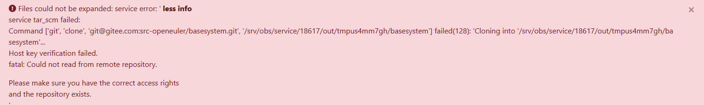
或者
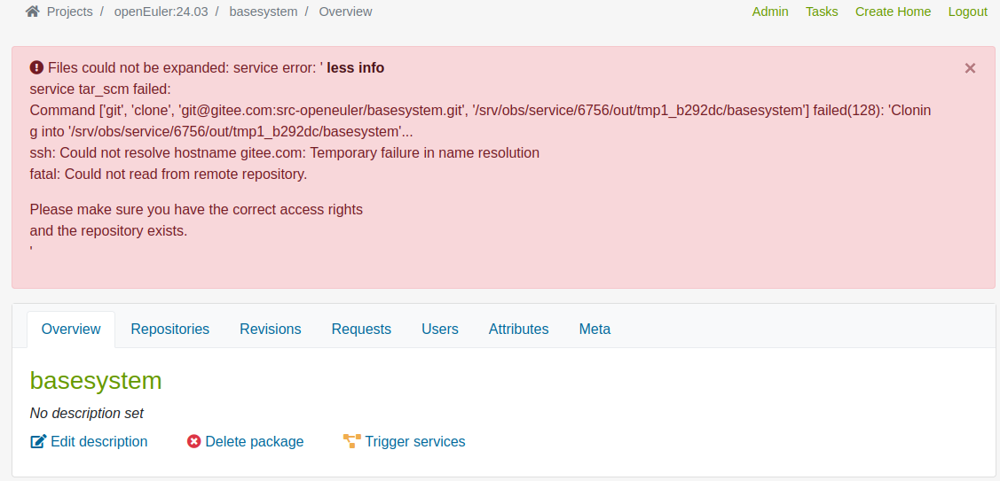

修改tar_scm的环境变量，在Git类的_get_scm_cmd函数开头初始化环境变量。

    vim /usr/lib/obs/service/TarSCM/scm/git.py

增加内容如下：

    os.environ["home"]="/srv/obs/service/"

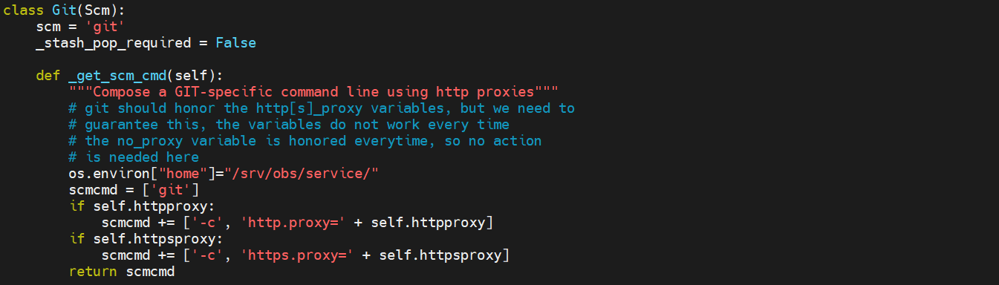

### 1.3 为obsservicerun用户创建密钥对

obsservicerun用户进行的拉取动作.

    sudo -u obsservicerun ssh-keygen

公钥钥配置到自己注册的gitee中，私钥则在/srv/obs/service/.ssh下。

### 1.4 如果sudo -u obsservicerun ssh-keygen失效

若/srv/obs/service目录下为空，需要给这个目录的所有权转移给obsservicerun用户，然后自己创建.ssh目录。

    mkdir -p /srv/obs/service/.ssh
    chown -R observicerun:observicerun /srv/obs/service

### 1.5 首次登陆输入yes

    leapfive:/srv/obs/service/.ssh # sudo -u obsservicerun git clone git@gitee.com:src-openeuler/A-FOT.git /srv/obs/service/test
    
    正克隆到 '/srv/obs/service/test'...
    remote: Enumerating objects: 59, done.
    remote: Counting objects: 100% (59/59), done.
    remote: Compressing objects: 100% (38/38), done.
    remote: Total 59 (delta 23), reused 55 (delta 21), pack-reused 0
    接收对象中: 100% (59/59), 47.54 KiB | 785.00 KiB/s, 完成.
    处理 delta 中: 100% (23/23), 完成.

## 2    worker状态异常
### 2.1 worker状态异常，包无法继续构建

节点没有状态显示，无法构建。

####    2.1.1   停掉调度服务

    rcobsscheduler stop

####    2.1.2   删除work的状态信息

server是读取/srv/obs/workers里面的信息来判定worker的状态。

    rm -rf /srv/obs/workers

####    2.1.3   确保页面worker status为no worker

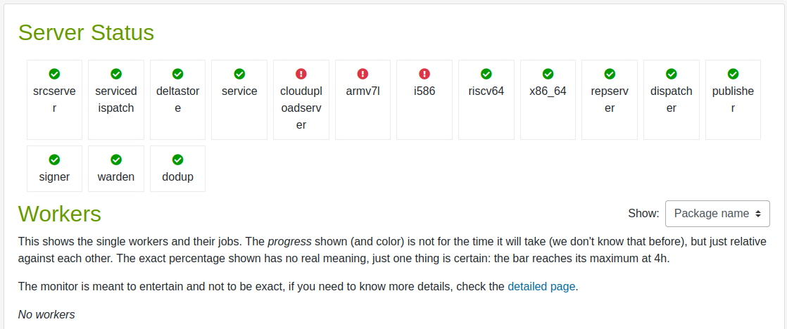

#### 2.1.4  在worker中重启obsworker

    systemctl restart obsworker
### 2.2 提示有坏节点

提示有badnode，schedulered的包无法继续构建

执行/usr/lib/obs/server的目录下bs_admin处理：

    /usr/lib/obs/server/bs_admin --list-badhosts

若是有坏节点，执行：

    /usr/lib/obs/server/bs_admin --drop-badhosts

### 2.3 包的缓存存在异常

在/srv/obs/jobs/riscv64/下有包的记录，找到对应的记录删除即可。

### 2.4 worker状态为空

是因为server读不到worker的状态信息。
可以参考**6 RPC错误**解决。

### 2.5 worker部分节点正常

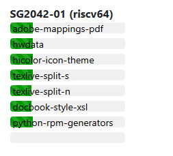

在/srv/obs/workers/里查看状态，会显示该节点节点down掉了，过一会该node会正常。

##  3   提示签名证书问题

打开OBS主页时，或者通过OSC访问服务器时，提示SSL证书有问题。需要服务端用私钥生成自签名CA证书，并放到客户端端。
证书思想和公钥私钥类似，都是两端进行验证。只是用途有区别。确保数据的完整性、身份验证和安全性。
###  3.1 服务器上

首先进入/srv/obs/certs目录

#### 3.1.1 在server服务器上生成自签名的证书

 ，生成一个 2048 位的 RSA 私钥，并保存为 server.key 文件。（名字自定义，只要和apache中的配置名一样即可）

    openssl genrsa -out server.key 4096

#### 3.1.2 用生成的私钥生成证书

用生成的私钥 obs-server.key 生成一个证书，指定CN=leapfive.zobs.com

    openssl req -new -x509 -key server.key -out server.crt -days 3650 -subj "/C=US/ST=State/L=City/O=leapfive.zobs.om/CN=leapfive.zobs.com"

#### 3.1.3 重启apache

    systemctl restart apache2

### 3.2 客户端上
#### 3.2.1  复制到可信列表

    cp /srv/obs/certs/server.crt /etc/pki/trust/anchors
    或者
    
    cd /etc/pki/trust/anchors
    scp  IPadress:/srv/obs/certs/server.crt .       #IPadress为server服务器的IP地址，证书的名字需和服务器上保持一致

#### 3.2.2  更新ca证书存储

    update-ca-certificates

#### 3.2.3  验证

    openssl s_client -connect  leapfive.zobs.com:443

末尾显示

    Verify return code: 0 (ok)

即为成功。

## 4    取消包签名

在构建过程中，签名这一步，会重新对包构建一次，使:full目录的包会构建两次，第二次时会出现问题（会去掉了Epoch字段，导致出现大量冲突等问题）。

（参考中科院的）取消包的签名，使其显示epoch字段，并让其Signature为none。如图：

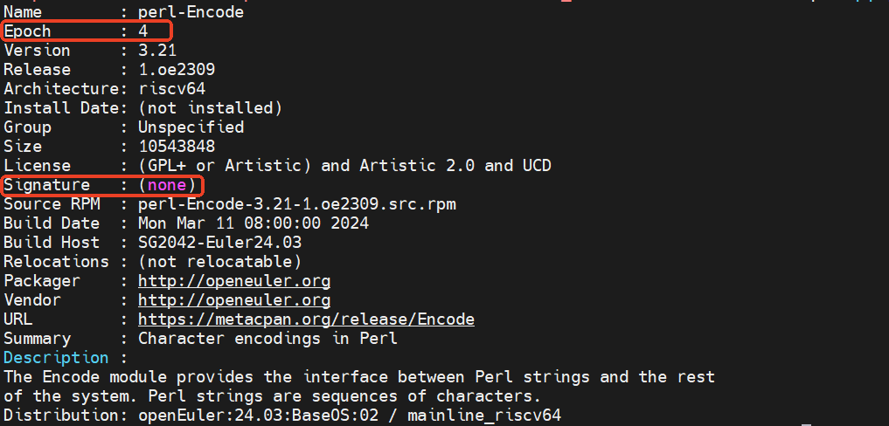

### 4.1 关掉服务

关闭signer服务，不关闭signd.

### 4.2 修改 /usr/lib/obs/server/BSConfig.pm 配置

注释掉our $sign，防止读取。

    vim /usr/lib/obs/server/BSConfig.pm
    
    #No package signing server
    #our $sign = "/usr/bin/sign";
    #Extend sign call with project name as argument "--project $NAME"
    #our $sign_project = 1;
    ......

### 4.3 修改/usr/lib/obs/server/setup-appliance.sh脚本

注释掉$sign = "/usr/bin/sign"这一行; 防止其每次运行时，去掉上一步在our $sign前加的#。

    vim /usr/lib/obs/server/setup-appliance.sh
    
    # signing setup
    perl -p -i -e 's,^\s*#\s*our \$gpg_standard_key.*,our \$gpg_standard_key = "/srv/obs/obs-default-gpg.asc";,' /usr/lib/obs/server/BSConfig.pm
    perl -p -i -e 's,^\s*#\s*our \$keyfile.*,our \$keyfile = "/srv/obs/obs-default-gpg.asc";,' /usr/lib/obs/server/BSConfig.pm
    #perl -p -i -e 's,^\s*#\s*our \$sign = .*,our \$sign = "/usr/bin/sign";,' /usr/lib/obs/server/BSConfig.pm
    perl -p -i -e 's,^\s*#\s*our \$forceprojectkeys.*,our \$forceprojectkeys = 1;,' /usr/lib/obs/server/BSConfig.pm
    chmod 4755 /usr/bin/sign

### 4.4 重启服务：

去掉/srv/obs/jobs/riscv64/里面的任务信息。
    
    systemctl restart obsapisetup.service

需要额外重启了obsrepserver服务，如有必要重启所有服务，严格按照顺序重启：
    必须先重启obssrcserver.service；然后才是obsrepserver.service；接着其他服务顺序无所谓。
    
        systemctl restart obssrcserver.service
        systemctl restart obsrepserver.service
        systemctl restart memcached.service
        systemctl restart obsservice.service
        systemctl restart obsscheduler.service
        systemctl restart obsdispatcher.service
        systemctl restart obspublisher.service
        systemctl restart obsapisetup.service
        systemctl restart obsdodup.service
        systemctl restart obsservicedispatch.service

如无法开始构建，进入项目的后台仓库，删除:full.solv文件，然后扫描，即可重新开始构建。
    
## 5    项目的Meta配置

当项目很多包都是**blocked**，没有**building**时（一般是因为依赖的包没有构建成功）。可以将该项目的**block="local"**变为**block="never"**。

**rebuild、block、linkedbuild**参数大致介绍如下（一般只用到rebuild、block）：

**rebuild**(触发构建)：控制如何触发和管理包的重新构建。
transitive：默认行为，对所有依赖包（包括间接依赖的包，即当前包的依赖的依赖）进行干净构建。适用于大范围更新及确保所有相关包在构建时是一致的。
direct：仅构建源代码发生变化的包及其直接依赖的包，但不构建间接依赖的包，可能会导致依赖项未完全更新。
local：仅构建源代码发生变化的包，快速构建已经修改过的包。

note:
选择 direct 或 local 时，可能会导致依赖关系出现问题。transitive 是最安全、最可靠的选择，但如果希望节省资源，direct 或 local 可能会更快，但也带来一定的风险，可能导致依赖未更新完全，最终可能导致安装或运行时的错误。

**block**：根据依赖的情况，控制构建过程中包是否阻塞。
all：默认行为，如果当一个包所需的依赖包当前正在构建，该包的构建会被阻塞。
local：仅关注同一个项目中的依赖。如果当前项目中，某包正在构建，依赖该包的包会被阻塞；若依赖双方不是在同一项目，则不会阻塞。
never：从不将包设置为阻塞状态，无论其依赖包是否已经完成构建，都会立即启动当前包的构建。

note:
all 是最安全的选项，确保所有依赖包在开始构建前已完成构建，local 和 never 可以提高构建效率，但可能会导致依赖未完全构建的风险，从而引发潜在的构建或运行时问题。

**linkedbuild**：在构建时控制，是否构建依赖其他项目的包。只能在依赖项目B中设置，而不是在被依赖项目A中设置的。假设B中某包依赖于A的包。
off ：默认值，B 项目不会使用项目 A 的构建结果，也不会因为依赖项目 A 而触发项目 A 的构建。可能导致失败
localdep：只有当项目 B 中的包明确依赖项目 A 中的包时，OBS 才会构建项目 A，否则不构建 A。如果 B 确实依赖 A 的结果，那么它会先构建 A，再继续构建 B。
alldirect：所有直接链接的项目（如 A）都会被构建，而间接链接的项目（即那些链接到 A 的其他项目）不会被构建。注意这里的链接项目仅仅指两个项目存在链接关系的两个项目，AB之间谁依赖谁都无所谓。
all：构建所有直接和间接链接的项目。

## 6    RPC错误

查看日志：

    cd /srv/obs/log
    tail -f *.log

若提示出现RPC错误，一般是防火墙端口问题。以下方法二选一

### 6.1 端口设置

确认ip+端口是否可用

    nc -vz ipaddress port

若不可用，需监听端口。

### 6.2 直接禁用防火墙

server和worker两端都执行：刷新规则，并关闭防火墙

    systemctl stop firewalld
    systemctl disable firewalld
    iptables -F

## 7     OBS仓库broken

若是OBS页面出现

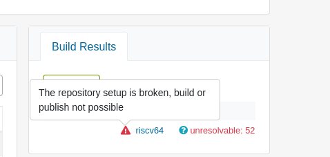

则在项目配置里面添加：
    
    Type: debian

若是OBS页面先是所有的包都是excluded

则在项目配置中添加：

    Type: dsc

##  8   Apache警告
PassengerPreStart 指令（一般是全局配置）默认位置错误

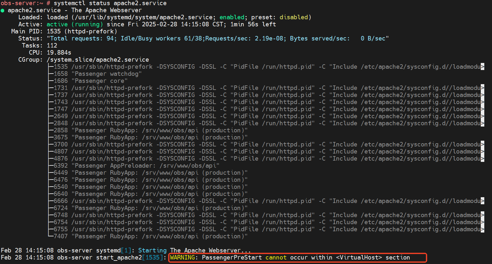

解决方法：

    vim /etc/httpd/conf.d/obs.conf

改到<VirtualHost> 配置块外

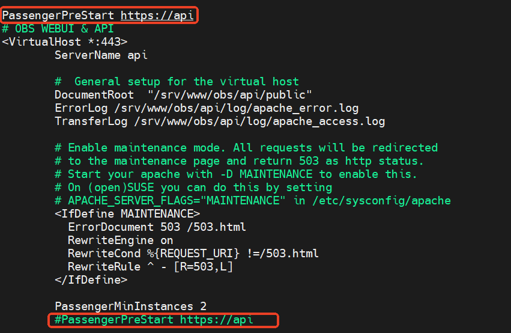

重启apache

    systemctl restart apache2

##  9   域名解析问题

**注：该问题在openSUSE 15.5存在，在openSUSE 15.6已修复。正常用短主机名，然后在/etc/hosts中添加"IP  完整域名 短主机名"即可。**

### 9.1 情况说明
OBS的给各种服务端口用到FQDN，解析在/usr/lib/obs/server/BSConfig.pm中配置
调用的PerlNet::Domain模块的hostfqdn()函数。
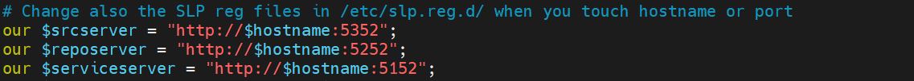
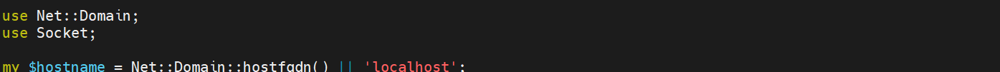

常见情况FQDN格式要求为：aaa.bbb.com。其中aaa为hostname，bbb为domain。
常规FQDN规则：
1：如果hostnamectl set-hostname是设置为aaa.bbb.com格式，则会直接将其作为FQDN.
2:  如果hostnamectl set-hostname是设置为xxxxx，没有“.”在名字里面。则会去/etc/hosts/中搜索每一行，看看哪一行的第二列和第三列中含有xxxxx，找到了则将该行的第二列作为FQDN(因为第一列是IP，第二列是aaa.bbb.com格式)。

但是OBS不一致，如：

按照规则最后域名应该是”leapfive.zobs.com“，但是FQDN还是解析为：

### 9.2 临时办法
暂时将hostname和网址的hostname部分统一，避免错误。
如：想要地址为“leapfive.zobs.com”，则hostname设置为leapfive，在/etc/hosts中添加”leapfive“到IP和域名行的后面。

或者直接设置FQDN：

    hostnamectl set-hostname leapfive.zobs.com

## 10   网页增加新架构无效
### 10.1    情况说明
通过管理员登陆后，在OBS主页页面-Configuration-Architecture中勾选了risc64之后，无法生效。

同时还可能出现 **Unknown state of repository** 的情况（尤其是刚部署好OBS时）
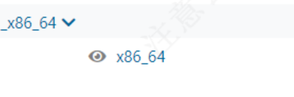

### 10.2    解决办法
编辑配置文件

    vim /srv/obs/configuration.xml

添加新架构比如：risc64，并且一定要 **重启服务**！！

    systemctl restart obsscheduler.service
##  11    包状态异常
包一直处于finished状态，成功的包不会变成sueccessed。

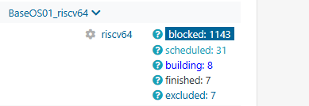
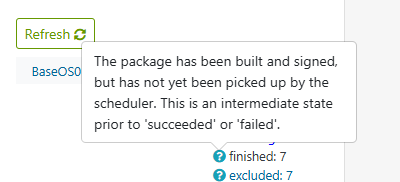
检查systemctl status obsscheduler.service服务状态

##  12    读取包的状态

    perl -MStorable -MData::Dumper -e 'print Dumper(retrieve(":packstate"))'
##  13    服务异常

正常情况下，这里是会有进程常驻的，如果出现没有进程常驻，则有可能是因为有些文件的权限不允许。
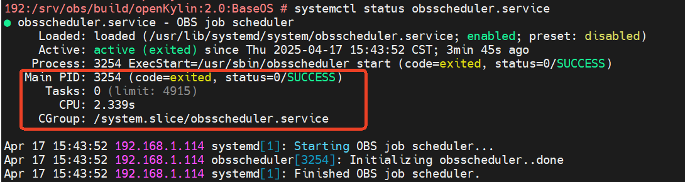

检查：

    find /srv/obs/build ! -user obsrun

正常情况是不应有输出的，如果有输出，则执行：

    chown -R obsrun:obsrun  /srv/obs/build

##  仓库
构建完成后，回到 **项目** 级别，点击**Build Results**中的想要下载的仓库名，会跳转仓库下载页面。
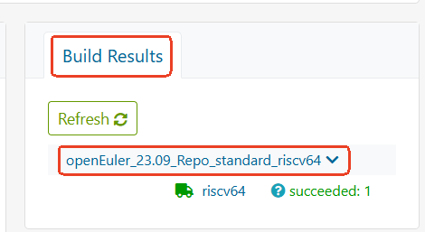

点击**Go to download repository**，可以对仓库进行下载。
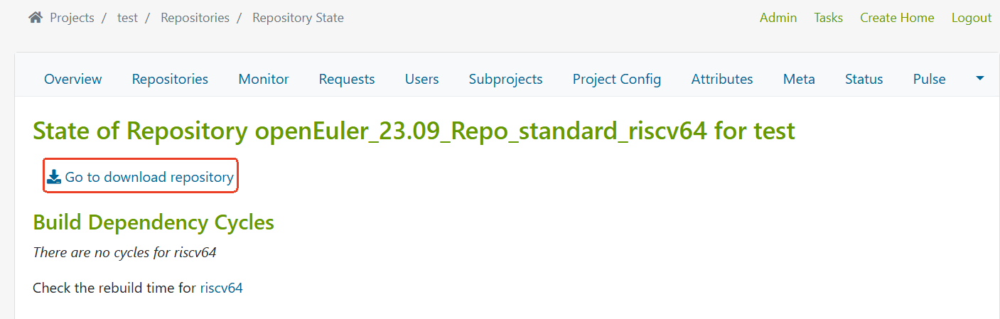

需要修改渲染下载仓库的链接按钮的配置：

    vim /srv/www/obs/api/app/views/webui2/shared/_download_repository_link.html.haml

修改为：

    /- url = "#{download_url}/#{project.to_s.gsub(/:/, ':/')}/#{repository}"
    - url = "http://192.168.1.114:82/#{project.to_s.gsub(/:/, ':/')}/#{repository}"
    %li.list-inline-item
    = link_to(url, title: 'Go to download repository', class: 'nav-link') do
        %i.fas.fa-download
        Go to download repository

其中 第一行开头的 **/** 后为注释内容，**#{download_url}** 改为 **http://192.168.1.114:82**（仓库的默认地址，配置在apache2关于obs的配置文件/etc/apache2/vhosts.d/obs.conf中），结合后面的 **project** 和 **repository** 可以实现具体某个仓库的下载。

##  其他
后端日志在 /srv/obs/log，前端日志在 /srv/www/obs/api/log。每个日志具体说明在：https://openbuildservice.org/help/manuals/obs-admin-guide/obs-cha-overview-filesystem#log-files

修改了主机域名需要在修改API配置：在/srv/www/obs/api/config/options.yml中的frontend_host。

启用 use_xforward：强烈建议在这里启用 use_xforward: true，以告诉 Rails 转发请求到后端进行异步处理。否则，前端在后端处理每个请求时会被阻塞。

