#   Abstract

整个OBS分为两个角色，OBS-server和OBS-Worker，OBS-server中运行后台服务，负责调度管理，OBS-Worker负责实际构建。

OBS-server：本示例未采用分布式安装，而是采用集中式安装，即所有的obs-server安装在一台机器上，系统为OpenSUSE15.5。
OBS-Worker：采用了两种方式；一台是OpenSUSE的虚拟机，一台是OpenEuler的物理机。具体配置会加以说明。
截至2024年/08/06官方仓库源没有适配最新的15.6，建议使用15.4或者15.5。
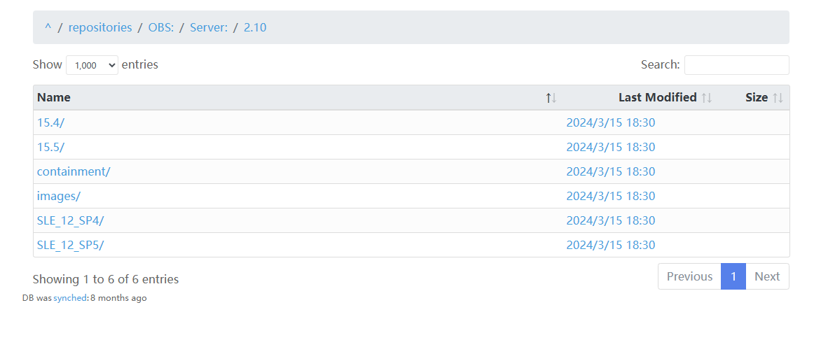

##  OBS平台规划

| Node  | 类型 | 配置|操作系统 |镜像地址|Tips | 
|---	|---	|---	|---	|---	|---	|
| obs-server | 物理机 | CPU:4核 内存：16G 硬盘：1T 架构：RISCV-64 |openSUSE-leap-15.5 | https://download.opensuse.org/distribution/leap/15.5/iso/openSUSE-Leap-15.5-DVD-x86_64-Media.iso|服务端，负责调度管理及存储构建好的RPM包 | 
| obs-worker | 物理机 | CPU:128核 内存：128G 硬盘：500G 架构：RISCV-64 |openEuler:24.03-LTS |https://mirror.iscas.ac.cn/openeuler-sig-riscv/openEuler-RISC-V/testing/20240708/v0.1/SG2042/openEuler-24.03-V1-xfce-sg2042-testing.img.zst |负责实际构建 | 
| obs-worker | 物理机 | CPU:128核 内存：128G 硬盘：500G 架构：RISCV-64 |openEuler:24.03-LTS |https://mirror.iscas.ac.cn/openeuler-sig-riscv/openEuler-RISC-V/testing/20240708/v0.1/SG2042/openEuler-24.03-V1-xfce-sg2042-testing.img.zst |负责实际构建 | 

此处为笔者实际生产环境配置，测试环境虚拟机开发板等等都可，具体配置根据实际需求而定。

# OBS-Server
## 1 安装OpenSUSE
此步略，移步OpenSUSE安装部署。

## 2 切换到root用户（后续会经常用到root模式）
    su

## 3 添加对应版本的OBS仓库源
    zypper ar -f https://download.opensuse.org/repositories/OBS:/Server:/2.10/15.5/OBS:Server:2.10.repo
**版本注意换成对应版本。**
检查仓库源是否添加成功

    zypper lr
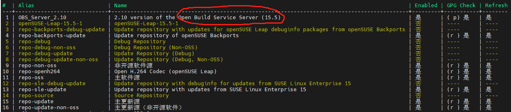
## 4 安装obs-server

    zypper refresh
    zypper in -t pattern OBS_Server
## 5 配置短主机名

OBS的的hostfqdn()函数，通过你设置的短主机名去/etc/hosts文件或者DNS中查找对应的ip地址及FQDN，
所以必须增加短主机名在最后。

短主机名：名称中没有“.”
FQDN:（Fully Qualified Domain Name,完全限定域名）名称中至少包含一个“.”

如果想设置短主机名为leapfive，且最后网址想为**leapfive.zobs.com**，需将短主机名配置到hosts的ip和域名解析后面。

##  配置短主机名

    hostnamectl set-hostname leapfive

## 配置hosts
    echo "192.168.20.85 leapfive.zobs.com   leapfive" >>/etc/hosts
**IP地址为Server的IP**
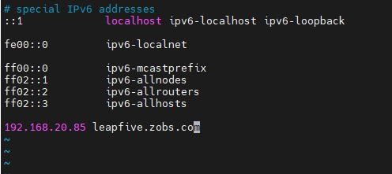

## 6 启动数据库
    systemctl enable mysql.service --now
确认为启用状态

    systemctl status mysql.service
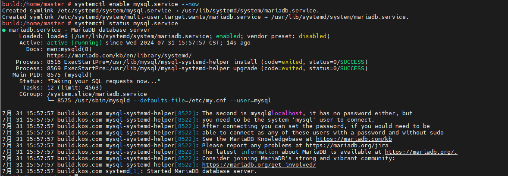
## 7 配置数据库
    mysql_secure_installation
大致包括以下部分内容(除了是否更改root密码：n其余全部回车)：
**验证当前root 用户的密码**
是否切换unix_socket身份验证：

是否更改root密码：n

删除匿名用户：
禁止 root 用户远程登录（可选）：
删除测试数据库：
重新加载权限表：

## 8 修改limits.conf
**该文件用于设置用户和组的资源限制，通过修改文件描述符、进程数、内存使用等限制优化系统性能和稳定性，尤其是在高负载环境中**

    vim /etc/security/limits.conf
添加两行

    * hard nofile 655360
    * hard nofile 655360
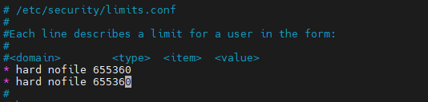
## 9 重新加载配置、重启数据库服务
    systemctl daemon-reload
    systemctl restart mariadb
## 10 执行OBS初始化脚本

每次出现一个Default: y，就回车

    /usr/lib/obs/server/setup-appliance.sh --force

此部分大致为：
生成 OBS 默认 GPG 密钥
为各个服务（如 obsrepserver, obssrcserver,）创建符号链接以开机自启动
配置 MariaDB检查并启用 MySQL 服务
初始化 MariaDB 数据库
创建具有所有权限的 MariaDB 用户 root 和 master
Initialize OBS api database （此步可能需要等待较长时间，只需一次，然后）

**检查并启用其他必要的服务，如 Apache2 。若apache2服务没有启动起来，需要重启处理,该阶段创建了证书**
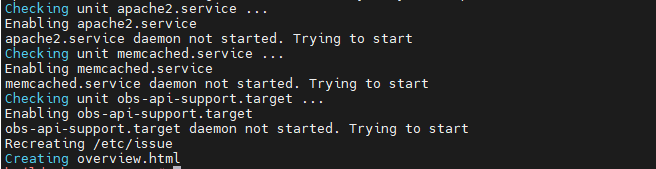

Note：这里可能会出现FQDN的问题：

FQDN常见的格式为leapfive.zobs.com。
1：如果hostnamectl set-hostname是设置为leapfive.zobs.com，则会直接将其作为FQDN.
2:如果hostnamectl set-hostname是设置为leapfive，则会去/etc/hosts/中搜索每一行的第二列和第三列，如果找到leapfivede，则将该行的第二列作为FQDN(因为第二列也是是完整域名，也满足FQDN格式)。

检查

    systemctl status apache2.service

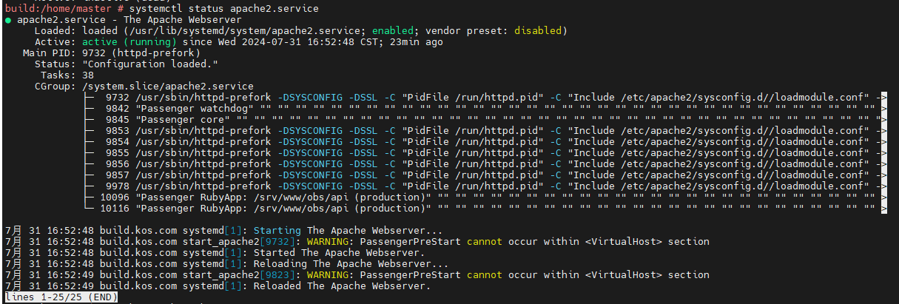   

## 11 查看obs的web界面

**通过 https://leapfive.zobs.com 访问obs的web界面**
**管理员Log in（Username:Admin,Password:opensuse）**

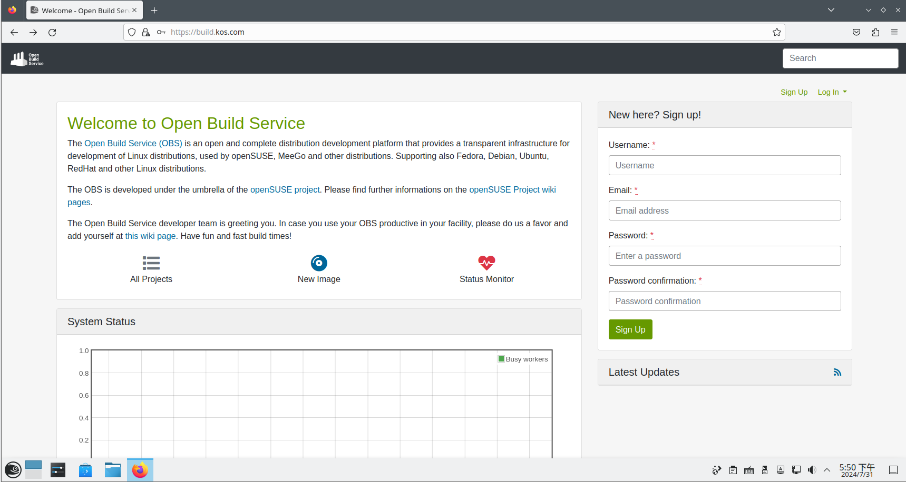 

## 12 OBS 配置 RPM 集中 sign 签名配置
（可以先不配置，LeapFive-OBS当前未配置）
### 配置密钥对
    gpg2 --full-gen-key
**提示设置密钥类型、设置密钥长度、设置有效期、用户绑定密钥**

    gpg (GnuPG) 2.2.27; Copyright (C) 2021 Free Software Foundation, Inc.
    This is free software: you are free to change and redistribute it.
    There is NO WARRANTY, to the extent permitted by law.
    
    gpg: 目录‘/home/master/.gnupg’已创建
    gpg: 钥匙箱‘/home/master/.gnupg/pubring.kbx’已创建
    请选择您要使用的密钥类型：
    (1) RSA 和 RSA （默认）
    (2) DSA 和 Elgamal
    (3) DSA（仅用于签名）
    (4) RSA（仅用于签名）
    (14) Existing key from card
    您的选择是？ 1
    RSA 密钥的长度应在 1024 位与 4096 位之间。
    您想要使用的密钥长度？(3072) 2048
    请求的密钥长度是 2048 位
    请设定这个密钥的有效期限。
         0 = 密钥永不过期
      <n>  = 密钥在 n 天后过期
      <n>w = 密钥在 n 周后过期
      <n>m = 密钥在 n 月后过期
      <n>y = 密钥在 n 年后过期
    密钥的有效期限是？(0) 0
    密钥永远不会过期
    这些内容正确吗？ (y/N) y
    
    GnuPG 需要构建用户标识以辨认您的密钥。
    
    真实姓名： zhangdi
    电子邮件地址： di.zhang@leapfive.com
    注释：
    您选定了此用户标识：
    “zhangdi <di.zhang@leapfive.com>”
    
    更改姓名（N）、注释（C）、电子邮件地址（E）或确定（O）/退出（Q）？ O
**设置密码(至少8位)**

    我们需要生成大量的随机字节。在质数生成期间做些其他操作（敲打键盘
    、移动鼠标、读写硬盘之类的）将会是一个不错的主意；这会让随机数
    发生器有更好的机会获得足够的熵。
    我们需要生成大量的随机字节。在质数生成期间做些其他操作（敲打键盘
    、移动鼠标、读写硬盘之类的）将会是一个不错的主意；这会让随机数
    发生器有更好的机会获得足够的熵。
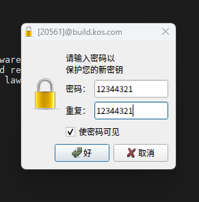  
**最后会输出密钥相关信息**

    gpg: /home/master/.gnupg/trustdb.gpg：建立了信任度数据库
    gpg: 密钥 FAC96F1ECFAB8604 被标记为绝对信任
    gpg: 目录‘/home/master/.gnupg/openpgp-revocs.d’已创建
    gpg: 吊销证书已被存储为‘/home/master/.gnupg/openpgp-revocs.d/0E12D057539E4694D6A0D114FAC96F1ECFAB8604.rev’
    公钥和私钥已经生成并被签名。
    
    pub   rsa2048 2024-09-09 [SC]
          0E12D057539E4694D6A0D114FAC96F1ECFAB8604
    uid                      zhangdi <di.zhang@leapfive.com>
    sub   rsa2048 2024-09-09 [E]
### 保存密码
    mkdir -v /root/.phrases
    echo -n '12344321' > /root/.phrases/di.zhang@leapfive.com		#passwd替换成自己刚设置的密码
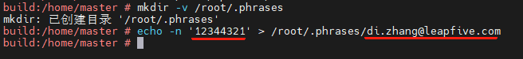 

#### 创建链接
**使根目录下的 .gnupg ，还是 /srv/obs 目录下的 gnupg，实际上都是在访问 /root/.gnupg 目录**

    ln -s /root/.gnupg /.gnupg 
    cd /srv/obs 
    rm gnupg/ -rf 
    ln -s /root/.gnupg gnupg

#### 导出公钥
**方便后续共享、备份等**

    gpg --armor --export di.zhang@leapfive.com > /etc/ourkeyfile.asc
#### 修改OBS配置文件
    vim /usr/lib/obs/server/BSConfig.pm

具体修改如下：

    #No package signing server 
    our $sign = "/usr/bin/sign"; 
    #Extend sign call with project name as argument "--project $NAME" 
    our $sign_project = 0; 
    #Global sign key 
    our $keyfile = "/etc/ourkeyfile.asc"; 
    our $gpg_standard_key = "/etc/ourkeyfile.asc";
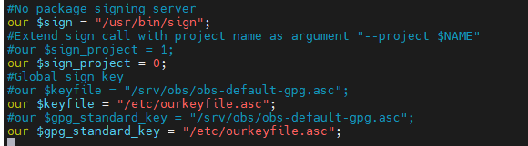 
### 修改签名配置文件
用于指定GPG 密钥标识、提供签名服务的服务器IP、允许使用签名服务的用户对象、允许访问签名服务的IP地址以及存储路径。**具体替换成自己的**

    vim /etc/sign.conf
    user: di.zhang@leapfive.com
    server: 192.168.20.90
    allowuser: obsrun
    allow: 192.168.20.90
    phrases: /root/.phrases
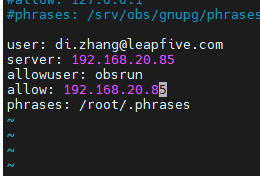 
### 激活服务
    systemctl enable obssignd.service
    systemctl enable obssigner.service
    systemctl start obssignd.service 
    systemctl start obssigner.service

### 验证签名服务大概是否正常
    sign -k
如能打印密钥 ID则表示签名服务正常
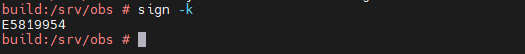 
若不能打印
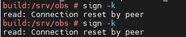 
查看日志

    journalctl -u obssignd.service
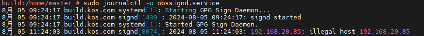 
**若提示非法主机,则vim /etc/sign.conf查看配置文件中allow是否有问题。**

然后重启signd服务即可

    systemctl restart obssignd.service
## 13 obs-server端相关服务
**obs-server服务拆分成了多个独立的服务,可用以下命令查看：**

    systemctl list-units --type=service | grep obs
    #内存缓存服务 
    systemctl enable memcached.service --now 
    #启动存库服务器 
    systemctl enable obsrepserver.service –now
    #源代码仓库服务 
    systemctl enable obssrcserver.service --now 
    #源服务 
    systemctl enable obsservice.service --now 
    #启动调度服务 
    systemctl enable obsscheduler.service --now 
    #分发服务 
    systemctl enable obsdispatcher.service --now 
    #启动发布服务 
    systemctl enable obspublisher.service --now 
    #启动数据库 
    systemctl enable mysql.service --now 
    #启动签名服务（可选） 
    systemctl enable obssigner.service --now 
    #启动监控服务（可选） 
    systemctl enable obswarden.service --now 
    #下载服务 
    systemctl enable obsdodup.service --now 
    #apache2-web服务 
    systemctl enable apache2 –now
**obs-server端主要负责管理，配置比较小；编译rpm包的工作是由obs-worker物理机负责，因此建议obs-server端停止掉 obsworker服务。**
查询obsworker服务

    systemctl status obsworker.service
禁用obsworker服务

    systemctl disable obsworker.service --now

# OBS-Worker
## 情况说明
Worker端若是采用了OpenSUSE的虚拟机，包管理是zypper；采用OpenEuler的物理机，包管理是dnf。
## 1 更新
    sudo -i			#进入root模式
    zypper update   # 更新所有已安装的软件包
## 2 增加obs仓库源
    sudo dnf config-manager --add-repo=https://download.opensuse.org/repositories/OBS:/Server:/2.10/15.5/OBS:Server:2.10.repo
    或者：
    zypper ar -f https://download.opensuse.org/repositories/OBS:/Server:/2.10/15.5/OBS:Server:2.10.repo

    dnf clean all
    dnf makecache
## 3 安装obs-worker
    dnf install  obs-worker
    或者：
    zypper in obs-worker
## 4 在worker端配置server相关信息
    vim /etc/sysconfig/obs-server
**修改如下：**

    OBS_SRC_SERVER="leapfive.zobs.com:5352" 
    OBS_REPO_SERVERS="leapfive.zobs.com:5252"
### 4.1 若OBS-worker端在虚拟机上

    OBS_WORKER_INSTANCES="4" 
    OBS_WORKER_JOBS="2"
### 4.2 若OBS-worker端在物理机上

    OBS_WORKER_INSTANCES="8"   #表示将启动 8 个独立的 worker 实例。每个实例是一个独立的构建进程，可以并行处理不同的软件包构建任务。
    OBS_WORKER_JOBS="8"        #表示每个 worker 实例在构建软件时可以使用的并行编译线程数。
**节点和作业数设置需按照实际情况调整，如虚拟机硬件设置参数大，物理机为资源有限的开发板时，可能虚拟机的参数可能更大。**
## 5 配置worker工作目录

需要确保/var/cache/obs/worker已存在，没有则mkdir -p创建

### 5.1 若OBS-worker端在虚拟机上
 (虚拟机插的一张SD卡，为sdb1，具体填写自己实际的分区盘。)

    mount /dev/sdb1 /var/cache/obs/worker

若想开机自动挂载，则需要修改文件系统表/etc/fstab。增加的内容如下（UUID需改成自己设备的，通过blkid查询）：

    UUID=0c84a8e4-c7b3-4f5d-b7e9-0eabf1f0e36a /var/cache/obs/worker ext4 defaults 0 2

### 5.2 若OBS-worker端在物理机上
#### 5.2.1 开发板
 若是在开发板上，需插的一张SD卡（因为板子内存较小，无法无法挂载为tmpfs形式），具体填写自己实际的分区盘

    mount /dev/mmcblk1p5 /var/cache/obs/worker

若想开机自动挂载，则需要修改文件系统表/etc/fstab。增加的内容同虚拟机一样。

#### 5.2.1 SG2042

因为SG2042服务器，有较大的内存，可以将worker的工作目录直接挂载到内存中，提高构建速度。

    vim /etc/fstab

增加的内容如下：

    tmpfs /dev/shm tmpfs defaults,size=50g 0 0  
    #大多数的Linux发行版中，/dev/shm 默认已经是 tmpfs，而且它的大小默认就是系统总 RAM 大小的一半。
    #使用df -h | grep shm查看，若没有配置则通过此步配置。
    
    #挂载为 RAM 磁盘（tmpfs），提高构建速度。
    tmpfs /var/cache/obs/worker tmpfs defaults,size=50g 0 0		#开发板不要此步

### 5.3 立即生效

    mount -a
    systemctl daemon-reload

### 5.4 修改权限
进入目录

    cd /var/cache/ 

修改

    chown obsrun:obsrun -R obs

## 6 修改主机名
设置主机名，以便其他节点识别该 OBS 工作节点（如：obsworker-01）：

    hostnamectl set-hostname SG2402-01

## 7 启动worker服务
    systemctl enable obsworker 
    systemctl restart obsworker
    systemctl status obsworker

# 其他
在server和worker中安装osc，方便以命令行的方式管理控制

更新包
    
    zypper update

安装osc 包

    zypper install osc

## 验证
在OBS-Server端以管理员登陆，然后点击页面下方Location下status monitor，即可看到worker节点。
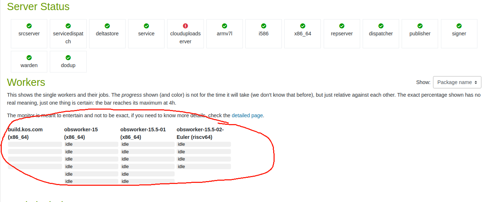 

## 补充

查询日志

    "journalctl -xeu obsworker.service" for details.

查询**worker.service**状态，提示不能通过通过端口访问**rep server**：
    

    systemctl status obsworker.service
    localhost:~ # systemctl status obsworker.service
    ● obsworker.service - OBS worker
     Loaded: loaded (/usr/lib/systemd/system/obsworker.service; enabled; vendor preset: disabled)
     Active: activating (start) since Wed 2024-09-11 17:03:02 CST; 16s ago
    Main PID: 9230 (obsworker)
      Tasks: 2 (limit: 4563)
     CGroup: /system.slice/obsworker.service
             ├─ 9230 /bin/sh /usr/sbin/obsworker start
             └─ 9251 sleep 10
    
    9月 11 17:03:02 obsworker01-OpenSuse15.5 systemd[1]: Starting OBS worker...
    9月 11 17:03:02 obsworker01-OpenSuse15.5 obsworker[9230]: Run 4 obsworker using /var/cache/obs/worker
    9月 11 17:03:02 obsworker01-OpenSuse15.5 obsworker[9230]: Type of obsworker is chroot
    9月 11 17:03:05 obsworker01-OpenSuse15.5 obsworker[9230]: Fetching initial worker code from http://:5252/getworkercode
    9月 11 17:03:05 obsworker01-OpenSuse15.5 obsworker[9247]: cpio: premature end of archive
    9月 11 17:03:05 obsworker01-OpenSuse15.5 obsworker[9230]: WARNING: Could not reach rep server http://192.168.20.166:5252. Trying again.
    9月 11 17:03:15 obsworker01-OpenSuse15.5 obsworker[9250]: cpio: premature end of archive
    9月 11 17:03:15 obsworker01-OpenSuse15.5 obsworker[9230]: WARNING: Could not reach rep server http://192.168.20.166:5252. Trying again.

解决方法：
    
    #在server端中查看端口信息，确保其正在监听。
    build:/srv/obs # ss -tuln | grep 5252
    tcp   LISTEN 0      512          0.0.0.0:5252       0.0.0.0:*
    #在worker节点中重新启用
    localhost:~ # systemctl restart obsworker
    
    #若仍无法监听则在server中打开防火墙限制，并重新加载防火墙配置
    build:/srv/obs # firewall-cmd --permanent --add-port=5252/tcp
    success
    build:/srv/obs # firewall-cmd --reload
    success
    
    #然后再worker节点中重新启用
    localhost:~ # systemctl restart obsworker

## 离线安装OBS-Server和OBS-Worker
以上为在线部署安装，下面对离线安装做出说明。

openSUSE的ISO和openEuler的img在"\\\192.168.1.42\LeapFive\DCSDK\DevOps-Assets-OBS"中。

需要安装的OBS包在"\\\192.168.1.42\LeapFive\DCSDK\DevOps-Assets-OBS\OBS离线包"中。
在opensuse中采用zypper包管理工具安装，在dnf中采用dnf包管理工具安装。

