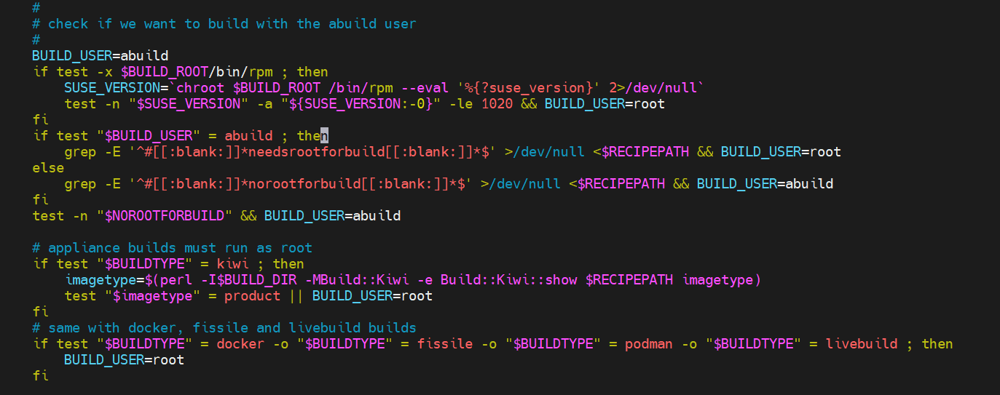

#	OBS使用
##  Abstract
记录在OBS一些使用技巧，以提升效率。

##  重要目录或者文件说明
###  项目-仓库-架构的后台目录

    /srv/obs/build/openKylin:Repo/standard_riscv64/riscv64/

为openKylin:Repo项目的standard_riscv64仓库，关于riscv64架构的后台仓库。

###  :packstatus文件

:packstatus文件是 Perl 的 Storable 模块生成的 二进制序列化文件。
记录了某个包的构建状态，及unresolvable的具体信息。

1、在批量解决依赖问题时，可以写脚本读取:packstatus文件，根据unresolvable信息，批量解决依赖。

2、制作镜像时，可以读取:packstatus文件， 当没有包的状态是building时（或者关键包都构建succeeded时），可以用Jenkins控制制作镜像。

3、若是想批量的disabled包，不建议修改:packstatus文件，建议用osc命令修改包的meta。

读取:packstatus文件，可以使用 Perl 的 Storable 模块：

    perl -MStorable -MData::Dumper -e 'print Dumper(retrieve(":packstatus"))'

###  :full.solv 文件
:full.solv 文件既是记录，也是为了加速而存在的。

具体来说：

记录：它包含当前项目或仓库中所有软件包的元数据（提供什么、需要什么等依赖信息）。

加速：OBS 使用这个文件来快速解析依赖关系、判断构建顺序和缺失依赖，比每次都重新解析 .rpm 或 .deb 包快得多。

每次执行：

    /usr/lib/obs/server/bs_admin --rescan-repository openEuler:24.03:BaseOS mainline02_riscv64 riscv64

时，会刷新:full.solv。
###  :full.solv 文件 

###  设置构建用户

默认情况下worker的构建用户是`abuild`，如server配置文件`/usr/lib/build/build`中切换用户逻辑`# check if we want to build with the abuild user`部分所示：

在对某个包进行构建时，默认是以`abuild`用户进行构建。
若想切换为`root`用户，在该包的SPEC文件开头添加`#needsrootforbuild`即可。

##  osc的使用
对于提交更改，可以分次进行，也可以一次性提交。
###  操作本地目录项目
####   检出项目：

    osc co openEuler:24.03               #检出项目
    osc co openEuler:24.03 acl         #仅检出项目中acl包

####   查看项目中包名单：

    osc ls openEuler:24.03

####   新建包：

进入项目目录：

    cd openEuler:24.03
新建包：

    osc mkpac bash			#会在bash里生成.osc文件夹 
若还需给bash包内导入文件：

    cd bash

在此目录下新增文件，最后加入版本控制并提交更改：

    osc add *		#加入版本控制
    osc commit -m "add bash package"	#提交修改
####   删除包或者文件
进入项目或者具体包的工作目录，包含.osc的级别皆可。
删除文件：

    osc delete FILE
提交更改
   
    osc commit -m "update"
###  操作远程项目
####   修改项目和包的meta配置：

    osc meta prj -e openEuler:24.03
    osc meta pkg -e openEuler:24.03 acl 

####   修改项目的Project Configuration配置：

如果其他OBS上有可用的Project Configuration，先把其配置文件下载下来：

    osc -A $OBSHOST_SOURCE meta prjconf $PROJECT_SOURCE > my_project.conf
或者（当无法访问 $OBSHOST_SOURCE时用curl）：

    curl $OBSHOST_SOURCE/public/source/$PROJECT_SOURCE/_config > my_project.conf
然后将my_project.conf（或修改后的my_project.conf）上传到OBS：

    vim my_project.conf
    osc -A $OBSHOST meta prjconf -F my_project.conf $PROJECT

也可直接网页界面（web UI）复制/粘贴项目配置。
####   从另一项目导入源码包：

    for i in $(osc -A https://build.tarsier-infra.isrc.ac.cn ls openEuler:24.03:SP1:Everything:RVA20)
    do
        osc -A https://build.tarsier-infra.isrc.ac.cn copypac \
            -t https://leapfive.zobs.com \
            openEuler:24.03:SP1:Everything:RVA20 \
            "$i" \
            openEuler:24.03:SP1:Everything:RVA20
    done

