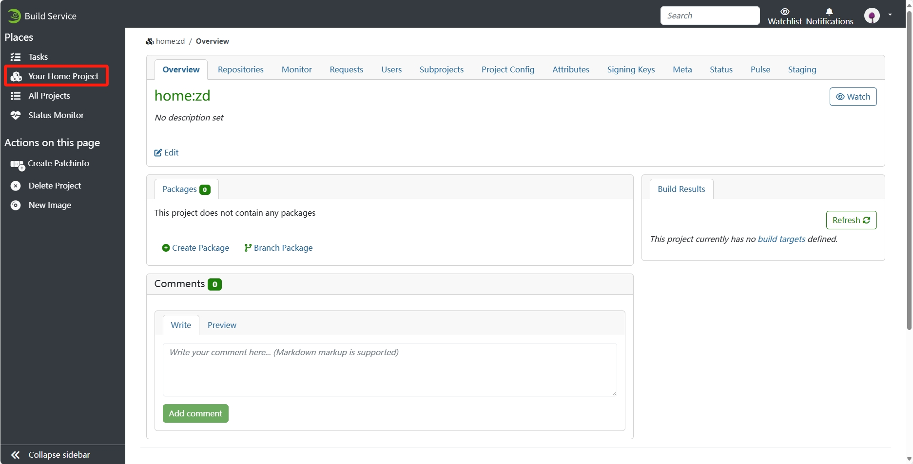
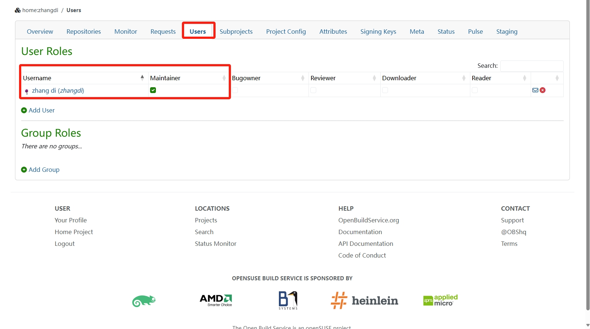
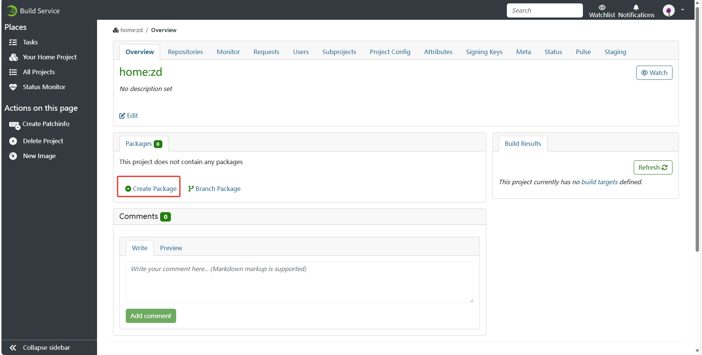
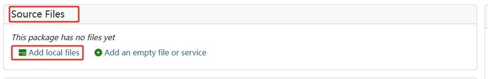
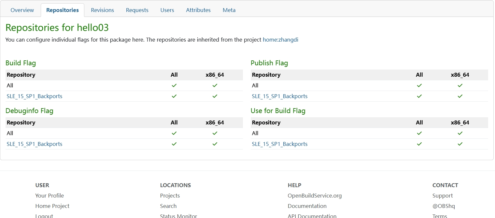
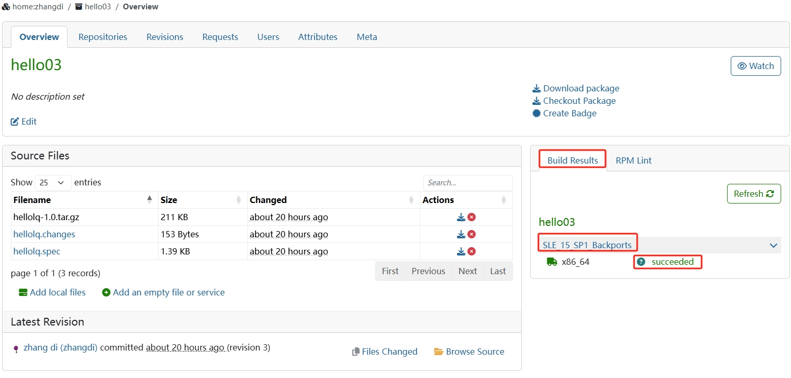
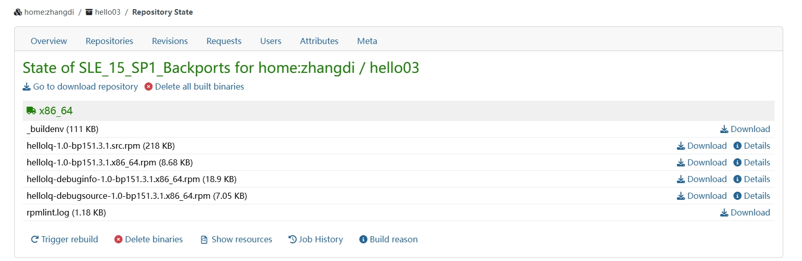
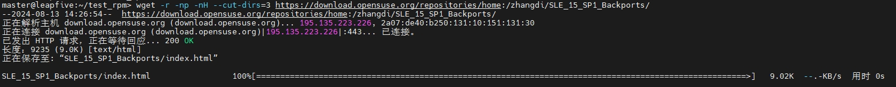
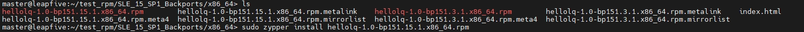

# 总览

前提是OBS中已有准备好的构建目标项目（参考构建基础项目）。

OBS打包服务的大致工作流程：
1、本地准备好源代码包，编辑好SPEC文件。
2、将各种相关文件提交给OBS服务器，服务器自动根据SPEC文件进行编译链接源代码，为各个版本Linux打包，并检查软件包信息。
 一共有两种方式：
Web页面的提交方式，命令行下的osc打包。
# 注册OBS帐号
去这个网站：https://build.opensuse.org/ 点击右上角“Sign Up”，注册自己帐号；
注册完成后，重新回到该网址；点击右上角的“Login”，用新账户登录进去。

# Web方式

登录 https://build.opensuse.org/ 网站之后，点击左上角的**Your Home Project**，就会进入自己的打包项目管理页面。

# 创建和上传包
点击**Users**设置为维护者**maintainer**

接着点击**Overview**,点击**Packages**下的**create new package**创建包。

填入相关信息后，**create**创建。

然后点击**Sources Files**栏的**Add file**添加文件。至少需要一个**源码压缩包**和**SPEC**文件。

# 配置项目

在项目的导航栏META中

    <project name="openEuler:24.03">
      <title>openEuler 24.03 LTS</title>
      <description>Change Review 1	2024/1/16	2024/2/10	25	Review 软件包变更（升级/退役/淘汰）</description>
      <url>https://gitee.com/openeuler/release-management/blob/master/openEuler-24.03-LTS/release-plan.md</url>
      <person userid="Admin" role="maintainer"/>
      <build>
        <enable/>
        <enable repository="mainline_riscv64"/>
      </build>
      <repository name="mainline_riscv64" rebuild="direct" block="local">
       <path project="openEuler:23.09:Repo" repository="standard_riscv64"/>
       <arch>riscv64</arch>
      </repository>
    </project>

**build**为构建设置标签：
**enable** 表示启用全局构建功能，允许整个项目进行构建；
**enable repository="mainline_riscv64"**，表示启用指定的**mainline_riscv64** 仓库进行构建。

**repository**为仓库配置标签：
**rebuild="direct"** 表示该仓库的重建方式为直接重建；**block="local"** 表示阻塞类型是本地，表示仓库为本地仓库，不受外部仓库影响。
**path**标签为仓库路径。**project="openEuler:23.09:Repo” repository="standard_riscv64**表示是**openEuler:23.09:Repo**项目中的**repository="standard_riscv64**仓库。

# 选择构建目标
转到项目的仓库“**Repositories**”选项卡，为然后单击“**Add from a Distribution**”，然后选择一个可用的发行版和体系结构。

# 源代码包和SPEC文件
具体步骤参考“**RPM打包练习.txt**”,有changes文件更好，做好打包记录是好习惯。changes文件可以自己用编辑器建一个，然后编辑，一样好使的。

# 源打包结果
最后在右侧会生成对应的打包结果，点击版本名即可跳转文件下载界面。

# 安装运行（示例）
下载仓库

进入对应的版本目录

安装**rpm**文件即可

然后直接输入文件名即可运行。