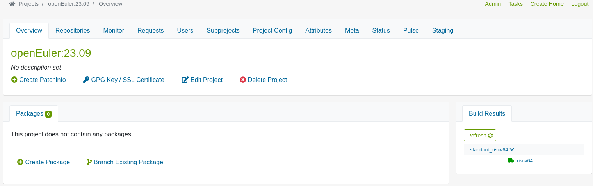
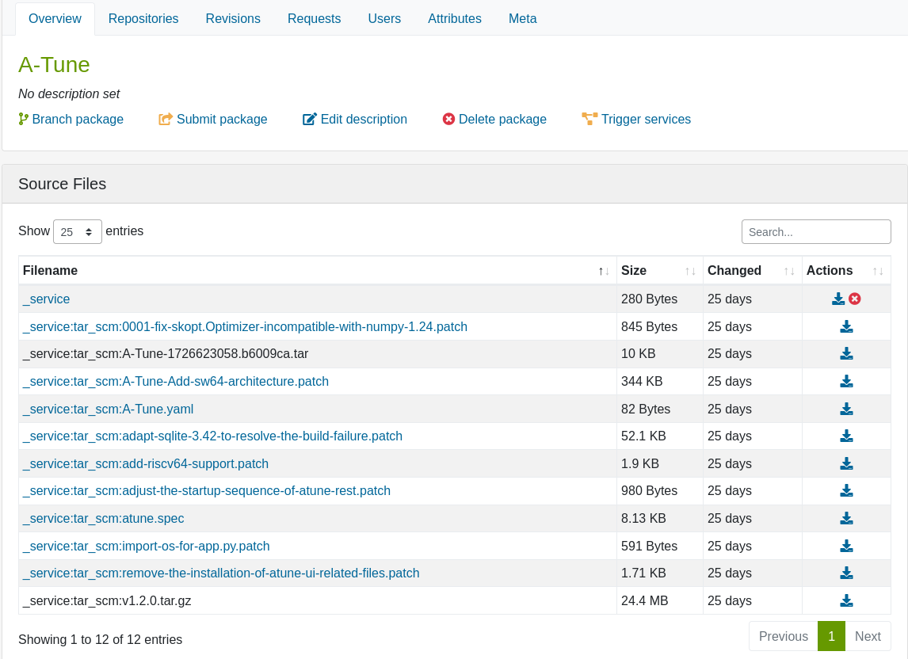
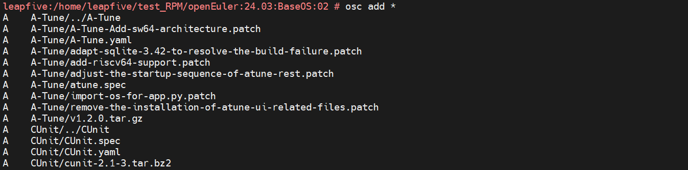
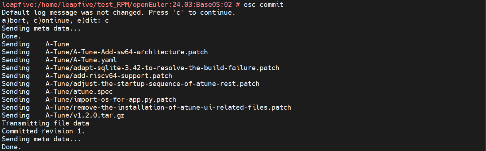
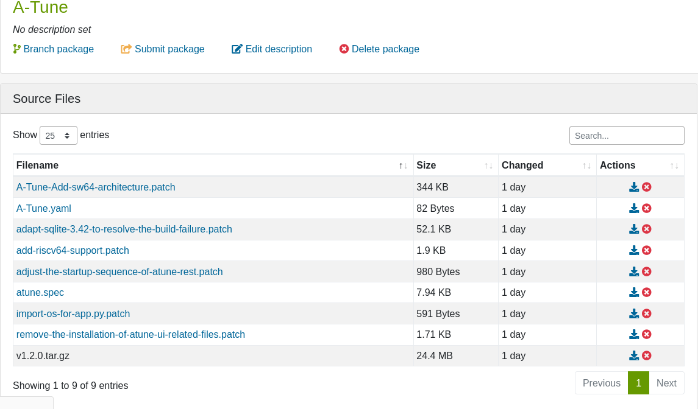

#    OBS构建项目
##   Abstract

在OBS中，项目可以作为构建依赖或是构建目标
（构建依赖：构建目标需要的rpm包来源
构建目标：待构建的软件包的系统架构及版本）。

构建依赖的项目可以是本地项目或远程项目（DoD）。

以本文为例，以openEuler:23.09作为基础项目，构建openEuler:24.03

大致步骤：
1、配置了一个DoD（远程依赖）的openEuler23.09项目
2、配置了一个openEuler24.03的项目。
3、将openEuler23.09作为openEuler24.03的依赖，24.03会继承23.09的Project Configuration，引用23.09的后台:full目录的rpm包。

最后基本成功构建了24.03，成功了1030个包。之后的想要构建24.03包时，可以直接将24.03项目作为他的构建目标。

涉及到的OBS使用部分参考打包教程。

##  1、 项目的基础配置介绍

项目主要关心的部分是**Project Configuration**和**Meta**两部分。

Project Configuration类似于SPEC文件，可以对整个项目所有的包进行控制。

Meta里面则是一些元数据：基本信息，构建控制。

##  2、 openEuler:23.09

### Project Configuration部分:
####    Project Configuration内容的语法
Preinstall:预安装，在构建开始时安装到chroot的包

Prefer:优先，当几个包都提供某个依赖时，在构建时优先使用这个包

Prefer: -A	全局不选 A，除非没其他选项

Prefer: my-web-server:nodejs

只有在my-web-server的情况才选择nodejs
例子：
假如有两个包:都提供 js-engine：

    quickjs
    nodejs

同时，两个待构建的包分别依赖这个 js-engine：

    my-web-server
    my-iot-agent

如想实现：

    my-web-server 使用 nodejs
    my-iot-agent 使用 quickjs

设置应为则：

    Prefer: my-web-server:nodejs
    Prefer: my-iot-agent:quickjs

其他的配置项可以参考[OBS构建配置官方文档](https://openbuildservice.org/help/manuals/obs-user-guide/cha-obs-prjconfig)

####    Project Configuration内容

    Substitute: python-devel

    Preinstall: iproute dhcp libatomic_ops
    #################################  针对 RISC-V 的一些特殊/临时配置 BEGIN ###############################################
    # 为使docker、qemu虚拟构建机工作，增加以下配置，不影响sg2042构建机
    VMInstall: util-linux libmount ncurses-libs coreutils libblkid libuuid libsmartcols grep pcre
    VMInstall: libxcrypt perl perl-libs perl-Digest-MD5 perl-Exporter perl-Carp
    # jose、lsof、vdo 等还需要这几个
    VMInstall: perl-File-Temp perl-PathTools perl-constant perl-File-Path perl-Scalar-List-Utils perl-parent
    # 2203以来一直是忽略boost对这两个包的require
    Substitute: libquadmath-devel
    Substitute: libquadmath-static
    # valgrind 当前还无法合入OE
    Substitute: valgrind
    Substitute: valgrind-devel
    
    %if 1
    ### Fri, 08 Sep 2023 copy from openEuler:23.09:selfbuild:BaseOS
    
    Prefer: libseccomp python2-pip wqy-zenhei-fonts openssl-devel gobject-introspection
    Conflict: nss-softokn nss-softokn-freebl
    
    Prefer: openEuler-rpm-config
    Prefer: openEuler-release
    Prefer: openEuler-logos euleros-logos
    Prefer: openEuler-repos
    Prefer: openEuler-indexhtml
    Prefer: protobuf-java protobuf-devel
    #custom prefer for openEuler
    Prefer: autogen texinfo glx-utils
    Prefer: jbig2dec java-1.8.0-openjdk-devel
    Prefer: mesa-devel fontpackages-filesystem
    #end
    # 解决postgresql和libpq冲突，两个包同时提供libpq.so.5(64bit)
    Prefer: postgresql-lib
    Prefer: java-1.7.0-openjdk-javadoc lxpolkit rubygem-minitest python3-capstone python2-webtest python-mock
    Prefer: sblim-sfcb crda clamav-data java-1.8.0-openjdk-javadoc pkcs11-helper-devel atlas
    Prefer: Lmod
    Prefer: lua
    Prefer: selinux-policy-mls perl-Archive-Extract-Z-Compress-Zlib perl-Archive-Extract-bz2-IO-Uncompress-Bunzip2
    Prefer: binutils-devel python2-fabric perl-Archive-Extract-gz-Compress-Zlib perl-Archive-Extract-lzma-IO-Uncompress-UnLzma perl-Archive-Extract-zip-Archive-Zip
    Prefer: perl-Archive-Extract-lzma-IO-Uncompress-UnLzma perl-Archive-Extract-tar-Archive-Tar perl-Archive-Extract-tar-tar perl-Archive-Extract-tar-Archive-Tar
    Prefer: perl-Archive-Extract-tbz-Archive-Tar-IO-Uncompress-Bunzip2 perl-Archive-Extract-txz-Archive-Tar-IO-Uncompress-UnXz perl-Archive-Extract-xz-IO-Uncompress-UnXz
    Prefer: postfix
    Prefer: selinux-policy-mls
    Prefer: libverto-tevent java-1.7.0-openjdk-devel kernel-devel
    Prefer: postfix selinux-policy-minimum
    Prefer: atlas-sse3
    Prefer: python-setuptools
    Prefer: elinks
    Prefer: libverto-libev
    Prefer: lua
    Prefer: kernel
    Prefer: rubygem-rspec
    Prefer: emacs
    Prefer: perl-Archive-Extract-tgz-Archive-Tar-Compress-Zlib
    Prefer: php-symfony3-options-resolver
    Prefer: golang-gopkg-check-devel
    Prefer: kernel-devel
    Prefer: rust-serde_derive-devel
    Prefer: openni-devel
    Prefer: perl-Archive-Extract-tgz-Archive-Tar-Compress-Zlib perl-Archive-Extract-Z-Compress-Zlib perl-Archive-Extract-bz2-IO-Uncompress-Bunzip2
    Prefer: perl-Archive-Extract-gz-Compress-Zlib rubygem-minitest rubygem-rspec gnuplot
    Prefer: perl-Archive-Extract-lzma-IO-Uncompress-UnLzma perl-Archive-Extract-tar-Archive-Tar perl-Archive-Extract-tbz-Archive-Tar-IO-Uncompress-Bunzip2
    Prefer: perl-Archive-Extract-txz-Archive-Tar-IO-Uncompress-UnXz perl-Archive-Extract-xz-IO-Uncompress-UnXz perl-Archive-Extract-zip-Archive-Zip
    Prefer: gnome-themes-standard
    Prefer: jbigkit-libs
    Prefer: libcdio-paranoia libcdio
    Prefer: java-1.8.0-openjdk glassfish-el-api glassfish-servlet-api
    # 2022 02 16
    Prefer: jakarta-el jakarta-server-pages-api
    
    #2021 09 10#
    Prefer: compat-openssl11-libs
    
    #2022 03 22#
    Prefer: jakarta-server-pages ocaml-camlp4 tinyxml2 ocaml-ocamlbuild ocaml-csexp
    
    #2022 06 06
    Prefer: jakarta-mail
    
    #2023 01 19
    Prefer: texlive-latex
    
    Substitute: /usr/bin/protoc protobuf
    Substitute: %{_bindir}/pathfix.py python3-devel
    Substitute: %{_bindir}/sgml2xml opensp
    Substitute: %{_bindir}/nsgmls opensp
    Substitute: %{_bindir}/ps procps-ng
    
    Substitute: %{_bindir}/sgml2xml opensp
    Substitute: python-dbus python2-dbus
    Substitute: /usr/sbin/useradd shadow
    Substitute: /usr/sbin/groupadd shadow
    Substitute: /usr/sbin/userdel shadow
    Substitute: /usr/sbin/groupdel shadow
    Substitute: /usr/bin/pod2man perl-podlators
    Substitute: %{_bindir}/dtrace systemtap
    Substitute: %{_bindir}/cmake cmake
    Substitute: %{_bindir}/dtrace systemtap-sdt-devel
    Substitute: %{_bindir}/cmake cmake
    Substitute: %{_bindir}/checksec checksec
    Substitute: %{_bindir}/sphinx-build python2-sphinx
    Substitute:  /usr/sbin/sendmail sendmail
    Substitute:  /usr/bin/pod2man perl-podlators
    Substitute:  /usr/bin/pdflatex texlive-latex-bin-bin
    Substitute:  /usr/bin/makeindex texlive-makeindex-bin
    Substitute: /lib/libc.so.6 glibc
    Substitute: /usr/lib/libc.so glibc
    Substitute: /lib64/libc.so.6 glibc
    Substitute: /usr/lib64/libc.so glibc
    Substitute: /usr/bin/xsltproc libxslt
    Substitute: /etc/init.d chkconfig
    Substitute: %{_includedir}/linux/if.h kernel-headers
    Substitute: /usr/bin/yelp-build yelp-tools
    Substitute: /usr/bin/ducktype python3-mallard-ducktype
    Substitute: /usr/bin/chrpath chrpath
    Substitute: /usr/bin/tclsh tcl
    Substitute: /usr/bin/file file
    Substitute: /usr/bin/base64 coreutils
    Substitute: /usr/bin/head coreutils
    Substitute: /usr/bin/sha256sum coreutils
    Substitute: /usr/bin/tr coreutils
    Substitute: /usr/bin/jq jq
    Substitute: %{_bindir}/pkg-config pkgconf-pkg-config
    Substitute: /usr/bin/gtk-update-icon-cache gtk-update-icon-cache
    Substitute: /usr/bin/c++ c++
    Substitute: %{_bindir}/sphinx-build-3 python3-sphinx
    Substitute: /usr/bin/awk gawk
    Substitute: /usr/bin/pathfix.py python3-devel
    Substitute: /usr/bin/doxygen doxygen
    Substitute: /usr/bin/execstack execstack
    Substitute: /usr/bin/g-ir-scanner gobject-introspection-devel
    Substitute: %{_bindir}/phpab php-theseer-autoload
    Substitute: %{_bindir}/phpunit php-phpunit-PHPUnit
    
    Substitute: %{_bindir}/rst2html python3-docutils
    Substitute: %{_bindir}/sphinx-build-2 python2-sphinx
    Substitute: %{_bindir}/valac vala
    
    Substitute: /usr/bin/pygmentize python3-pygments
    Substitute: /usr/bin/perl perl
    Substitute: /usr/bin/iconv glibc-common
    Substitute: %{_bindir}/hostname hostname
    Substitute: %{_bindir}/a2x asciidoc
    Substitute: /usr/bin/certtool gnutls-utils
    Substitute: /usr/bin/socat socat
    Substitute: /usr/sbin/ss iproute
    Substitute: /usr/bin/cmp diffutils
    Substitute: /usr/bin/rename util-linux
    Substitute: /usr/sbin/sysctl procps-ng
    Substitute: %{_bindir}/libgcrypt-config libgcrypt-devel
    Substitute: /usr/bin/man man-db
    Substitute: /usr/bin/dtrace systemtap-sdt-devel
    Substitute: /usr/sbin/ifconfig net-tools
    Substitute: %{_bindir}/sphinx-build python2-sphinx
    Substitute: /usr/include/gnu/stubs-32.h glibc32
    Substitute: /usr/bin/dbus-launch dbus-x11
    Substitute: /usr/bin/2to3 python3-devel
    Substitute: %{_bindir}/xsltproc libxslt
    Substitute: %{_bindir}/sed sed
    Substitute: %{_bindir}/sphinx-build-2 python2-sphinx
    Substitute: %{_bindir}/sphinx-build-3 python3-sphinx
    Substitute: python%{python3_pkgversion}-devel python3-devel
    Substitute: python%{python3_pkgversion}-setuptools python3-setuptools
    Substitute: python%{python3_pkgversion}-chardet python3-chardet
    Substitute: python%{python3_pkgversion}-urllib3 python3-urllib3
    Substitute: python%{python3_pkgversion}-idna python3-idna
    Substitute: python%{python3_pkgversion}-pytest python3-pytest
    Substitute: python%{python3_pkgversion}-pytest-cov python3-pytest-cov
    Substitute: python%{python3_pkgversion}-pytest-httpbin python3-pytest-httpbin
    Substitute: python%{python3_pkgversion}-pytest-mock python3-pytest-mock
    Substitute: python%{python3_pkgversion}-pip python3-pip
    Substitute: python%{python3_pkgversion}-wheel python3-wheel
    Substitute: /usr/bin/dnf dnf
    Substitute: /usr/bin/zip zip
    Substitute: pkgconfig(libsystemd-journal) systemd-devel
    Substitute: %{_prefix}/share/i18n/locales/de_DE glibc-locale-source
    Substitute: /usr/bin/ssh-add openssh-clients
    Substitute: /usr/bin/ssh-agent openssh-clients
    Substitute: /usr/bin/ssh openssh-clients
    Substitute:  /usr/bin/appstream-util libappstream-glib
    Substitute: /usr/bin/xmlto xmlto
    Substitute: /etc/init.d chkconfig
    Substitute: %{_includedir}/linux/if.h kernel-headers
    Substitute: /usr/bin/dbus-launch dbus-x11
    Substitute: /lib/libc.so.6 glibc32
    Substitute: /usr/lib/libc.so glibc32
    Substitute: /lib64/libc.so.6 glibc
    Substitute: /usr/lib64/libc.so glibc
    Substitute: /usr/bin/qemu-img  qemu
    Substitute: /usr/bin/pod2man perl-podlators
    Substitute:  /usr/bin/appstream-util libappstream-glib
    Substitute:  /usr/bin/xmlto xmlto
    Substitute: /usr/bin/pod2html perl
    Substitute: /usr/sbin/mke2fs e2fsprogs
    Substitute: %{_libdir}/krb5/plugins/kdb/db2.so krb5-libs
    Substitute: /usr/bin/gtk-encode-symbolic-svg gtk3-devel
    Substitute: /usr/bin/dos2unix dos2unix
    Substitute: /usr/bin/unix2dos dos2unix
    Substitute: /usr/bin/which which
    Substitute: /usr/bin/epstopdf texlive-epstopdf
    Substitute: /usr/bin/desktop-file-validate desktop-file-utils
    #Substitute: pkgconfig(libavcodec) ffmpeg-devel
    Substitute: /usr/bin/valac vala
    Substitute: %{_bindir}/xsltproc libxslt
    Substitute: %{_bindir}/desktop-file-validate desktop-file-utils
    Substitute: %{_bindir}/appstream-util libappstream-glib
    Substitute: /usr/bin/ssh-agent openssh-clients
    Substitute: /usr/bin/ssh-add openssh-clients
    Substitute: /usr/bin/2to3 python3-devel
    Substitute: /usr/bin/texi2dvi texinfo-tex
    Substitute: /usr/bin/ssh openssh-clients
    Substitute: %{_bindir}/pod2html perl-podlators
    Substitute: %{_bindir}/pod2man 	perl-podlators
    Substitute: /usr/bin/pod2text perl-podlators
    Substitute: /usr/bin/ping iputils
    Substitute: /usr/bin/wget wget
    Substitute: /usr/bin/qemu-img qemu-img
    Substitute: /usr/bin/kreadconfig5 kf5-kconfig-core
    Substitute: /usr/bin/xmllint libxml2
    Substitute: /usr/bin/nc nmap-ncat
    Substitute: /usr/bin/lsof lsof
    Substitute: /usr/bin/ps procps-ng
    Substitute: %{__perl} perl
    Substitute: /usr/bin/rpcgen rpcgen
    Substitute: %{_bindir}/latex texlive-latex
    Substitute: /usr/bin/sphinx-build python2-sphinx
    Substitute: %{_bindir}/sphinx-build python2-sphinx
    Substitute: %{_bindir}/memcached memcached
    Substitute: /usr/bin/tox python3-tox
    Substitute: %{_bindir}/2to3 python3-devel
    Substitute: %{_bindir}/mongod mongodb-server
    Substitute: %{_bindir}/redis-server redis
    Substitute: %{_bindir}/pkill procps-ng
    Substitute: %{_bindir}/netstat net-tools
    Substitute: %{_bindir}/gpg gnupg
    Substitute: %{__make} make
    Substitute: %{_datadir}/a2ps/afm/phvr.afm a2ps
    Substitute: %{_bindir}/podselect perl-Pod-Parser
    Substitute: /usr/bin/autopoint gettext-devel
    Substitute: %{_bindir}/perl perl
    Substitute: %{_bindir}/openssl openssl
    Substitute: %{_bindir}/man man-db
    Substitute: /usr/bin/zip zip
    Substitute: /usr/bin/c++ gcc
    Substitute: /usr/bin/makeinfo texinfo
    Substitute: %{_includedir}/magic.h file-devel
    Substitute: python2dist(markdown) python2-markdown
    Substitute: %{_bindir}/python python-unversioned-command
    Substitute: %{_includedir}/gnu/stubs-32.h glibc32
    Substitute:  /usr/bin/dnf dnf
    Substitute: /usr/bin/getopt util-linux
    Substitute: mysql-devel mariadb-connector-c-devel
    Substitute: gnupg gnupg2
    Substitute: audiofile{?_isa} audiofile
    Substitute: /etc/pki/tls/certs/ca-bundle.crt ca-certificates

    Prefer: perl-libs fonts-filesystem apr libnghttp2 dnf dnf-plugins-core mozjs60 gstreamer1-plugins-base jboss-websocket-1.0-api
    Prefer: nodejs-nan0 uglify-js boost-devel
    
    Prefer: ccid libglvnd-devel device-mapper-persistent-data dbus-libs rpm-libs
    Prefer: libffi7 libffi6 ima-evm-utils
    Prefer: maven pipewire
    Prefer: jetty-http jetty-io jetty-security jetty-server jetty-servlet jetty-util
    
    Substitute: librpm.so.8()(64bit) rpm-libs
    Substitute: "python(abi) = 3.7" "python(abi) = 3.8"
    %endif
    
    %if 0
    ### Fri, 08 Sep 2023 copy from openEuler:23.09:selfbuild:BaseOS
    
    Macros:
    # Add for glibc by xiasenlin，2022/02/23, related issue:https://gitee.com/src-openeuler/obs_meta/issues/I4UXKX
    %glibc_abort_after_test_fail 1
    :Macros
    
    Preinstall: glibc bash rpm rpm-libs
    Preinstall: libcap libacl libdb bzip2 zlib xz-libs zstd lua popt openssl-libs attr compat-openssl11-libs
    #Preinstall: libcap libacl libdb bzip2 zlib xz-libs zstd lua popt compat-openssl11-libs attr
    Preinstall: libselinux pcre2 dbus-libs systemd-libs lz4 libgcrypt libgpg-error
    Preinstall: filesystem
    Preinstall: digest-list-tools selinux-policy-targeted pesign-obs-integration
    Preinstall: cmake
    # add for rust, 20230920
    Preinstall: libatomic
    # add digest-list-tools selinux-policy-targeted by senlin for :https://gitee.com/openeuler/digest-list-tools/issues/I4VUK0?from=project-issue
    # add pesign-obs-integration by senlin for: https://e.gitee.com/open_euler/issues/list?is%5Bsearch%5D=%E6%91%98%E8%A6%81%E5%88%97%E8%A1%A8&is%5Bissue_type_id%5D=-1&issue=I4VUK0

    Support: chkconfig
    Support: util-linux
    Support: rpm-build
    Support: make
    #Support: custom_build_tool-nocheck
    
    Order: filesystem:glibc
    Order: filesystem:bash
    Order: ncurses-libs:filesystem
    Order: coreutils:openssl-libs
    Order: audit:systemd
    Order: cryptsetup:unbound-libs
    Order: cryptsetup:openssh-server
    
    Support: gcc_secure
    
    #BuildFlags: logidlelimit:1800
    
    Macros:
    %source_date_epoch_from_changelog Y
    %clamp_mtime_to_source_date_epoch Y
    %use_source_date_epoch_as_buildtime Y
    :Macros
    
    Order: filesystem:glibc
    Order: filesystem:vim-filesystem
    Order: filesystem:emacs-filesystem
    Order: filesystem:acl
    Order: filesystem:attr
    Order: filesystem:libgcc
    Order: filesystem:setup
    Order: filesystem:bash
    
    FileProvides: /usr/bin/fipscheck  fipscheck
    FileProvides: /usr/bin/db_stat    libdb-utils
    FileProvides: /usr/bin/gdb-add-index gdb
    FileProvides: /usr/bin/gpg2 gnupg2
    FileProvides: /usr/bin/ruby       ruby
    FileProvides: /usr/bin/python python2
    FileProvides: /usr/bin/python2 python2
    FileProvides: /usr/bin/python3 python3
    FileProvides: /usr/bin/dtrace systemtap-sdt-devel
    FileProvides: /usr/sbin/ifconfig net-tools
    FileProvides: /usr/bin/execstack execstack
    %endif

    %if 1
    ### Fri, 08 Sep 2023 copy from openEuler:23.09:selfbuild:BaseOS
    Macros:
    %nocheck_exclude qt5-qtbase
    %__brp_digest_list /usr/lib/rpm/brp-digest-list %{buildroot}
    %nodejs_arches aarch64 x86_64 riscv64
    :Macros
    
    Release: %{?release}
    
    Macros:
    %openeuler 1
    %openEuler 1
    %_specdir %{_topdir}/SOURCES
    %openblas_arches  aarch64  x86_64 riscv64
    
    %_vendor openEuler
    %_isa %{?__isa:(%{__isa})}%{!?__isa:%{nil}}
    %vendor http://openeuler.org
    %distribution Huawei openEuler
    %packager http://openeuler.org
    
    #for sign
    %_signature gpg
    %_gpg_path /home/abuild/.gnupg
    %_gpg_name private OBS
    %__gpg_sign_cmd         %{__gpg} \
        gpg --no-verbose --no-armor \
        %{?_gpg_digest_algo:--digest-algo %{_gpg_digest_algo}} \
        --batch --pinentry-mode=loopback --passphrase="" \
        --no-secmem-warning \
        %{?_gpg_sign_cmd_extra_args:%{_gpg_sign_cmd_extra_args}} \
        -u "%{_gpg_name}" -sbo %{__signature_filename} %{__plaintext_filename}
    
    %kernel_module_package_buildreqs kernel-devel openEuler-rpm-config
    
    %with_python3 1
    %with_python2 1
    %python3_pkgversion 3
    #%__os_install_post %{nil}
    %python3_pkgversion 3
    %golang_arches %{ix86} x86_64 %{arm} aarch64 ppc64le s390x riscv64
    %efi_arch aa64
    %efi_vendor openEuler
    %efi aarch64 x86_64 riscv64
    %unsignedaa64 shim-unsigned-aarch64
    %unsignedx64 shim-unsigned-x64
    %unsignedia32 shim-unsigned-ia32
    %shimveraa64 15
    %shimverx64 15
    %shimveria32 15
    %valgrind_arches %{ix86} x86_64 %{arm} aarch64 ppc64le s390x
    %mono_arches %{ix86} x86_64 %{arm} aarch64 ppc64le s390x
    %openblas_arches %{ix86} x86_64 %{arm} aarch64 ppc64le s390x riscv64
    %ocaml_native_compiler   %{ix86} x86_64 %{arm} aarch64 ppc64le s390x riscv64
    %ocaml_natdynlink        %{ix86} x86_64 %{arm} aarch64 ppc64le s390x riscv64
    %ocaml_native_profiling  %{ix86} x86_64 %{arm} aarch64 ppc64le s390x riscv64
    %with_ocaml 1
    %dist .oe2309
    
    %ext_info .gz
    %ext_man .gz
    #%_unpackaged_files_terminate_build 0
    
    %info_add(:-:) test -x /sbin/install-info -a -f %{?2}%{?!2:%{_infodir}}/%{1}%ext_info && /sbin/install-info --info-dir=%{?2}%{?!2:%{_infodir}} %{?2}%{?!2:%{_infodir}}/%{1}%ext_info \
    %{nil}
    
    %info_del(:-:) test -x /sbin/install-info -a ! -f %{?2}%{?!2:%{_infodir}}/%{1}%ext_info && /sbin/install-info --quiet --delete --info-dir=%{?2}%{?!2:%{_infodir}} %{?2}%{?!2:%{_infodir}}/%{1}%ext_info \
    %{nil}
    
    # 2022-02-17 add automake
    %gcc_secure_exclude "gcc-for-openEuler.spec|podman.spec|gcc.spec|arm-trusted-firmware.spec|docker-engine-openeuler.spec|arts.spec|runc-openeuler.spec|kata-containers.spec|dyninst.spec|ipxe.spec|tboot.spec|syslinux.spec|gcc-libraries.spec|kpatch.spec|gdb.spec|xorg-x11-server.spec|xorg-x11-drv-fbdev.spec|xorg-x11-drv-vesa.spec|xorg-x11-drv-ati.spec|xorg-x11-drv-dummy.spec|xorg-x11-drv-intel.spec|xorg-x11-drv-nouveau.spec|xorg-x11-drv-qxl.spec|xorg-x11-drv-v4l.spec|xorg-x11-drv-vmware.spec|xorg-x11-drv-evdev.spec|xorg-x11-drv-synaptics.spec|xorg-x11-drv-vmmouse.spec|xorg-x11-drv-void.spec|xorg-x11-drv-wacom.spec|hivex.spec|gimp.spec|memstomp.spec|supermin.spec|system-config-firewall.spec|isdn4k-utils.spec|emacs.spec|graphviz.spec|buildah.spec|rhash.spec|automake.spec"
    
    %_build_id_links none
    
    #custom macros
    %openEuler 1
    %disable_rpath \
    sed -i 's|^hardcode_libdir_flag_spec=.*|hardcode_libdir_flag_spec=""|g' libtool \
    sed -i 's|^runpath_var=LD_RUN_PATH|runpath_var=DIE_RPATH_DIE|g' libtool
    
    %delete_la_and_a \
    find $RPM_BUILD_ROOT -type f -name "*.la" -delete \
    find $RPM_BUILD_ROOT -type f -name "*.a" -delete
    
    %delete_la  find $RPM_BUILD_ROOT -type f -name "*.la" -delete
    
    %chrpath_delete find $RPM_BUILD_ROOT/ -type f -exec file {} ';' | grep "\<ELF\>" | awk -F ':' '{print $1}' | xargs -i chrpath --delete {}
    
    %package_help        \
    %package        help \
    Summary:        Documents for %{name} \
    Buildarch:      noarch \
    Requires:		man info \
    \
    %description help \
    Man pages and other related documents for %{name}.
    
    #%sbin_installinfo_rm bc.info
    #%sbin_installinfo_rm bc.info.gz
    
    %install_info() \
    /sbin/install-info %1 %{_infodir}/dir || :
    
    %install_info_rm() \
    /sbin/install-info --remove %1 %{_infodir}/dir || :
    :Macros
    %endif
    
    %if 1
    Macros:
    %_texmf          /usr/share/texlive/texmf-local
    %_texmf_main     /usr/share/texlive/texmf-dist
    %_texmf_vendor   /usr/share/texlive/texmf-dist
    %_texmf_var      /var/lib/texmf
    %_texmf_conf     /usr/share/texlive/texmf-config
    
    %texlive_post \
    mkdir -p /var/run/texlive \
    touch /var/run/texlive/run-texhash \
    touch /var/run/texlive/run-mtxrun \
    :
    
    %texlive_postun \
    if [ $1 == 1 ]; then \
    mkdir -p /var/run/texlive \
    touch /var/run/run-texhash \
    else \
    %{_bindir}/texhash 2> /dev/null \
    fi \
    :
    
    %texlive_posttrans \
    if [ -e /var/run/texlive/run-texhash ] && [ -e %{_bindir}/texhash ]; then %{_bindir}/texhash 2> /dev/null; rm -f /var/run/texlive/run-texhash; fi \
    if [ -e /var/run/texlive/run-mtxrun ]; then export TEXMF=/usr/share/texlive/texmf-dist; export TEXMFCNF=/usr/share/texlive/texmf-dist/web2c; export TEXMFCACHE=/var/lib/texmf; %{_bindir}/mtxrun --generate &> /dev/null; rm -f /var/run/texlive/run-mtxrun; fi \
    :
    
    :Macros
    %endif

    %if 1
    Preinstall: glibc bash rpm rpm-libs
    Preinstall: libcap libacl libdb bzip2 zlib xz-libs zstd lua popt openssl-libs attr compat-openssl11-libs
    #Preinstall: libcap libacl libdb bzip2 zlib xz-libs zstd lua popt compat-openssl11-libs attr
    Preinstall: libselinux pcre2 dbus-libs systemd-libs lz4 libgcrypt libgpg-error
    Preinstall: filesystem
    Preinstall: digest-list-tools selinux-policy-targeted pesign-obs-integration
    # add digest-list-tools selinux-policy-targeted by senlin for :https://gitee.com/openeuler/digest-list-tools/issues/I4VUK0?from=project-issue
    # add pesign-obs-integration by senlin for: https://e.gitee.com/open_euler/issues/list?is%5Bsearch%5D=%E6%91%98%E8%A6%81%E5%88%97%E8%A1%A8&is%5Bissue_type_id%5D=-1&issue=I4VUK0

    Support: chkconfig
    Support: util-linux
    Support: rpm-build
    Support: make
    #Support: custom_build_tool-nocheck
    
    Order: filesystem:glibc
    Order: filesystem:bash
    Order: ncurses-libs:filesystem
    Order: coreutils:openssl-libs
    Order: audit:systemd
    Order: cryptsetup:unbound-libs
    Order: cryptsetup:openssh-server
    
    Support: gcc_secure
    
    BuildFlags: logidlelimit:1800
    
    Macros:
    %source_date_epoch_from_changelog Y
    %clamp_mtime_to_source_date_epoch Y
    %use_source_date_epoch_as_buildtime Y
    :Macros
    
    Order: filesystem:glibc
    Order: filesystem:vim-filesystem
    Order: filesystem:emacs-filesystem
    Order: filesystem:acl
    Order: filesystem:attr
    Order: filesystem:libgcc
    Order: filesystem:setup
    Order: filesystem:bash
    
    FileProvides: /usr/bin/fipscheck  fipscheck
    FileProvides: /usr/bin/db_stat    libdb-utils
    FileProvides: /usr/bin/gdb-add-index gdb
    FileProvides: /usr/bin/gpg2 gnupg2
    FileProvides: /usr/bin/ruby       ruby
    FileProvides: /usr/bin/python python2
    FileProvides: /usr/bin/python2 python2
    FileProvides: /usr/bin/python3 python3
    FileProvides: /usr/bin/dtrace systemtap-sdt-devel
    FileProvides: /usr/sbin/ifconfig net-tools
    FileProvides: /usr/bin/execstack execstack
    
    Prefer: libseccomp python2-pip wqy-zenhei-fonts openssl-devel gobject-introspection
    Conflict: nss-softokn nss-softokn-freebl
    
    Prefer: openEuler-rpm-config
    Prefer: openEuler-release
    Prefer: openEuler-logos euleros-logos
    Prefer: openEuler-repos
    Prefer: openEuler-indexhtml
    Prefer: protobuf-java protobuf-devel
    #custom prefer for openEuler
    Prefer: autogen texinfo glx-utils
    Prefer: jbig2dec java-1.8.0-openjdk-devel
    Prefer: mesa-devel fontpackages-filesystem
    #end
    # 解决postgresql和libpq冲突，两个包同时提供libpq.so.5(64bit)
    Prefer: postgresql-lib
    Prefer: java-1.7.0-openjdk-javadoc lxpolkit rubygem-minitest python3-capstone python2-webtest python-mock
    Prefer: sblim-sfcb crda clamav-data java-1.8.0-openjdk-javadoc pkcs11-helper-devel atlas
    Prefer: Lmod
    Prefer: lua 
    Prefer: selinux-policy-mls perl-Archive-Extract-Z-Compress-Zlib perl-Archive-Extract-bz2-IO-Uncompress-Bunzip2 
    Prefer: binutils-devel python2-fabric perl-Archive-Extract-gz-Compress-Zlib perl-Archive-Extract-lzma-IO-Uncompress-UnLzma perl-Archive-Extract-zip-Archive-Zip 
    Prefer: perl-Archive-Extract-lzma-IO-Uncompress-UnLzma perl-Archive-Extract-tar-Archive-Tar perl-Archive-Extract-tar-tar perl-Archive-Extract-tar-Archive-Tar 
    Prefer: perl-Archive-Extract-tbz-Archive-Tar-IO-Uncompress-Bunzip2 perl-Archive-Extract-txz-Archive-Tar-IO-Uncompress-UnXz perl-Archive-Extract-xz-IO-Uncompress-UnXz 
    Prefer: postfix
    Prefer: selinux-policy-mls 
    Prefer: libverto-tevent java-1.7.0-openjdk-devel kernel-devel
    Prefer: postfix selinux-policy-minimum
    Prefer: atlas-sse3
    Prefer: python-setuptools
    Prefer: elinks
    Prefer: libverto-libev
    Prefer: lua
    Prefer: kernel
    Prefer: rubygem-rspec
    Prefer: emacs
    Prefer: perl-Archive-Extract-tgz-Archive-Tar-Compress-Zlib
    Prefer: php-symfony3-options-resolver
    Prefer: golang-gopkg-check-devel
    Prefer: kernel-devel
    Prefer: rust-serde_derive-devel
    Prefer: openni-devel
    Prefer: perl-Archive-Extract-tgz-Archive-Tar-Compress-Zlib perl-Archive-Extract-Z-Compress-Zlib perl-Archive-Extract-bz2-IO-Uncompress-Bunzip2
    Prefer: perl-Archive-Extract-gz-Compress-Zlib rubygem-minitest rubygem-rspec gnuplot
    Prefer: perl-Archive-Extract-lzma-IO-Uncompress-UnLzma perl-Archive-Extract-tar-Archive-Tar perl-Archive-Extract-tbz-Archive-Tar-IO-Uncompress-Bunzip2 
    Prefer: perl-Archive-Extract-txz-Archive-Tar-IO-Uncompress-UnXz perl-Archive-Extract-xz-IO-Uncompress-UnXz perl-Archive-Extract-zip-Archive-Zip
    Prefer: gnome-themes-standard
    Prefer: jbigkit-libs
    Prefer: libcdio-paranoia libcdio
    Prefer: java-1.8.0-openjdk glassfish-el-api glassfish-servlet-api 
    # 2022 02 16
    Prefer: jakarta-el jakarta-server-pages-api
    
    #2021 09 10#
    Prefer: compat-openssl11-libs
    
    #2022 03 22#
    Prefer: jakarta-server-pages ocaml-camlp4 tinyxml2 ocaml-ocamlbuild ocaml-csexp
    
    #2022 06 06
    Prefer: jakarta-mail
    
    #2023 01 19
    Prefer: texlive-latex
    
    Substitute: /usr/bin/protoc protobuf
    Substitute: %{_bindir}/pathfix.py python3-devel
    Substitute: %{_bindir}/sgml2xml opensp
    Substitute: %{_bindir}/nsgmls opensp
    Substitute: %{_bindir}/ps procps-ng
    
    Substitute: %{_bindir}/sgml2xml opensp
    Substitute: python-dbus python2-dbus
    Substitute: /usr/sbin/useradd shadow
    Substitute: /usr/sbin/groupadd shadow
    Substitute: /usr/sbin/userdel shadow
    Substitute: /usr/sbin/groupdel shadow
    Substitute: /usr/bin/pod2man perl-podlators
    Substitute: %{_bindir}/dtrace systemtap
    Substitute: %{_bindir}/cmake cmake
    Substitute: %{_bindir}/dtrace systemtap-sdt-devel
    Substitute: %{_bindir}/cmake cmake
    Substitute: %{_bindir}/checksec checksec
    Substitute: %{_bindir}/sphinx-build python2-sphinx
    Substitute:  /usr/sbin/sendmail sendmail
    Substitute:  /usr/bin/pod2man perl-podlators
    Substitute:  /usr/bin/pdflatex texlive-latex-bin-bin
    Substitute:  /usr/bin/makeindex texlive-makeindex-bin
    Substitute: /lib/libc.so.6 glibc
    Substitute: /usr/lib/libc.so glibc
    Substitute: /lib64/libc.so.6 glibc
    Substitute: /usr/lib64/libc.so glibc
    Substitute: /usr/bin/xsltproc libxslt
    Substitute: /etc/init.d chkconfig
    Substitute: %{_includedir}/linux/if.h kernel-headers
    Substitute: /usr/bin/yelp-build yelp-tools
    Substitute: /usr/bin/ducktype python3-mallard-ducktype
    Substitute: /usr/bin/chrpath chrpath
    Substitute: /usr/bin/tclsh tcl
    Substitute: /usr/bin/file file
    Substitute: /usr/bin/base64 coreutils
    Substitute: /usr/bin/head coreutils
    Substitute: /usr/bin/sha256sum coreutils
    Substitute: /usr/bin/tr coreutils
    Substitute: /usr/bin/jq jq
    Substitute: %{_bindir}/pkg-config pkgconf-pkg-config
    Substitute: /usr/bin/gtk-update-icon-cache gtk-update-icon-cache
    Substitute: /usr/bin/c++ c++
    Substitute: %{_bindir}/sphinx-build-3 python3-sphinx
    Substitute: /usr/bin/awk gawk
    Substitute: /usr/bin/pathfix.py python3-devel
    Substitute: /usr/bin/doxygen doxygen
    Substitute: /usr/bin/execstack execstack
    Substitute: /usr/bin/g-ir-scanner gobject-introspection-devel
    Substitute: %{_bindir}/phpab php-theseer-autoload
    Substitute: %{_bindir}/phpunit php-phpunit-PHPUnit
    
    Substitute: %{_bindir}/rst2html python3-docutils
    Substitute: %{_bindir}/sphinx-build-2 python2-sphinx
    Substitute: %{_bindir}/valac vala
    
    Substitute: /usr/bin/pygmentize python3-pygments
    Substitute: /usr/bin/perl perl
    Substitute: /usr/bin/iconv glibc-common
    Substitute: %{_bindir}/hostname hostname
    Substitute: %{_bindir}/a2x asciidoc
    Substitute: /usr/bin/certtool gnutls-utils
    Substitute: /usr/bin/socat socat
    Substitute: /usr/sbin/ss iproute
    Substitute: /usr/bin/cmp diffutils
    Substitute: /usr/bin/rename util-linux
    Substitute: /usr/sbin/sysctl procps-ng
    Substitute: %{_bindir}/libgcrypt-config libgcrypt-devel
    Substitute: /usr/bin/man man-db
    Substitute: /usr/bin/dtrace systemtap-sdt-devel
    Substitute: /usr/sbin/ifconfig net-tools
    Substitute: %{_bindir}/sphinx-build python2-sphinx
    Substitute: /usr/include/gnu/stubs-32.h glibc32
    Substitute: /usr/bin/dbus-launch dbus-x11
    Substitute: /usr/bin/2to3 python3-devel
    Substitute: %{_bindir}/xsltproc libxslt
    Substitute: %{_bindir}/sed sed
    Substitute: %{_bindir}/sphinx-build-2 python2-sphinx
    Substitute: %{_bindir}/sphinx-build-3 python3-sphinx
    Substitute: python%{python3_pkgversion}-devel python3-devel
    Substitute: python%{python3_pkgversion}-setuptools python3-setuptools
    Substitute: python%{python3_pkgversion}-chardet python3-chardet
    Substitute: python%{python3_pkgversion}-urllib3 python3-urllib3
    Substitute: python%{python3_pkgversion}-idna python3-idna
    Substitute: python%{python3_pkgversion}-pytest python3-pytest
    Substitute: python%{python3_pkgversion}-pytest-cov python3-pytest-cov
    Substitute: python%{python3_pkgversion}-pytest-httpbin python3-pytest-httpbin
    Substitute: python%{python3_pkgversion}-pytest-mock python3-pytest-mock
    Substitute: python%{python3_pkgversion}-pip python3-pip
    Substitute: python%{python3_pkgversion}-wheel python3-wheel
    Substitute: /usr/bin/dnf dnf
    Substitute: /usr/bin/zip zip
    Substitute: pkgconfig(libsystemd-journal) systemd-devel
    Substitute: %{_prefix}/share/i18n/locales/de_DE glibc-locale-source
    Substitute: /usr/bin/ssh-add openssh-clients
    Substitute: /usr/bin/ssh-agent openssh-clients
    Substitute: /usr/bin/ssh openssh-clients
    Substitute:  /usr/bin/appstream-util libappstream-glib
    Substitute: /usr/bin/xmlto xmlto
    Substitute: /etc/init.d chkconfig 
    Substitute: %{_includedir}/linux/if.h kernel-headers
    Substitute: /usr/bin/dbus-launch dbus-x11
    Substitute: /lib/libc.so.6 glibc32
    Substitute: /usr/lib/libc.so glibc32
    Substitute: /lib64/libc.so.6 glibc
    Substitute: /usr/lib64/libc.so glibc
    Substitute: /usr/bin/qemu-img  qemu
    Substitute: /usr/bin/pod2man perl-podlators
    Substitute:  /usr/bin/appstream-util libappstream-glib
    Substitute:  /usr/bin/xmlto xmlto
    Substitute: /usr/bin/pod2html perl
    Substitute: /usr/sbin/mke2fs e2fsprogs
    Substitute: %{_libdir}/krb5/plugins/kdb/db2.so krb5-libs
    Substitute: /usr/bin/gtk-encode-symbolic-svg gtk3-devel
    Substitute: /usr/bin/dos2unix dos2unix
    Substitute: /usr/bin/unix2dos dos2unix
    Substitute: /usr/bin/which which
    Substitute: /usr/bin/epstopdf texlive-epstopdf
    Substitute: /usr/bin/desktop-file-validate desktop-file-utils
    #Substitute: pkgconfig(libavcodec) ffmpeg-devel
    Substitute: /usr/bin/valac vala
    Substitute: %{_bindir}/xsltproc libxslt
    Substitute: %{_bindir}/desktop-file-validate desktop-file-utils
    Substitute: %{_bindir}/appstream-util libappstream-glib
    Substitute: /usr/bin/ssh-agent openssh-clients
    Substitute: /usr/bin/ssh-add openssh-clients
    Substitute: /usr/bin/2to3 python3-devel
    Substitute: /usr/bin/texi2dvi texinfo-tex
    Substitute: /usr/bin/ssh openssh-clients
    Substitute: %{_bindir}/pod2html perl-podlators
    Substitute: %{_bindir}/pod2man 	perl-podlators
    Substitute: /usr/bin/pod2text perl-podlators
    Substitute: /usr/bin/ping iputils
    Substitute: /usr/bin/wget wget
    Substitute: /usr/bin/qemu-img qemu-img
    Substitute: /usr/bin/kreadconfig5 kf5-kconfig-core
    Substitute: /usr/bin/xmllint libxml2
    Substitute: /usr/bin/nc nmap-ncat
    Substitute: /usr/bin/lsof lsof
    Substitute: /usr/bin/ps procps-ng
    Substitute: %{__perl} perl
    Substitute: /usr/bin/rpcgen rpcgen
    Substitute: %{_bindir}/latex texlive-latex
    Substitute: /usr/bin/sphinx-build python2-sphinx
    Substitute: %{_bindir}/sphinx-build python2-sphinx
    Substitute: %{_bindir}/memcached memcached
    Substitute: /usr/bin/tox python3-tox
    Substitute: %{_bindir}/2to3 python3-devel
    Substitute: %{_bindir}/mongod mongodb-server
    Substitute: %{_bindir}/redis-server redis
    Substitute: %{_bindir}/pkill procps-ng
    Substitute: %{_bindir}/netstat net-tools
    Substitute: %{_bindir}/gpg gnupg
    Substitute: %{__make} make
    Substitute: %{_datadir}/a2ps/afm/phvr.afm a2ps
    Substitute: %{_bindir}/podselect perl-Pod-Parser
    Substitute: /usr/bin/autopoint gettext-devel
    Substitute: %{_bindir}/perl perl
    Substitute: %{_bindir}/openssl openssl
    Substitute: %{_bindir}/man man-db
    Substitute: /usr/bin/zip zip
    Substitute: /usr/bin/c++ gcc
    Substitute: /usr/bin/makeinfo texinfo
    Substitute: %{_includedir}/magic.h file-devel
    Substitute: python2dist(markdown) python2-markdown
    Substitute: %{_bindir}/python python-unversioned-command
    Substitute: %{_includedir}/gnu/stubs-32.h glibc32
    Substitute:  /usr/bin/dnf dnf  
    Substitute: /usr/bin/getopt util-linux
    Substitute: mysql-devel mariadb-connector-c-devel
    Substitute: gnupg gnupg2
    Substitute: audiofile{?_isa} audiofile
    Substitute: /etc/pki/tls/certs/ca-bundle.crt ca-certificates
    
    Release: %{?release} 
    
    Macros:
    %openeuler 1
    %openEuler 1
    %_specdir %{_topdir}/SOURCES
    %openblas_arches  aarch64  x86_64
    
    %_vendor openEuler
    %_isa %{?__isa:(%{__isa})}%{!?__isa:%{nil}}
    %vendor http://openeuler.org
    %distribution Huawei openEuler
    %packager http://openeuler.org
    
    #for sign
    %_signature gpg
    %_gpg_path /home/abuild/.gnupg
    %_gpg_name private OBS
    %__gpg_sign_cmd         %{__gpg} \
        gpg --no-verbose --no-armor \
        %{?_gpg_digest_algo:--digest-algo %{_gpg_digest_algo}} \
        --batch --pinentry-mode=loopback --passphrase="" \
        --no-secmem-warning \
        %{?_gpg_sign_cmd_extra_args:%{_gpg_sign_cmd_extra_args}} \
        -u "%{_gpg_name}" -sbo %{__signature_filename} %{__plaintext_filename}
    
    %kernel_module_package_buildreqs kernel-devel openEuler-rpm-config
    
    %with_python3 1
    %with_python2 1
    %python3_pkgversion 3
    #%__os_install_post %{nil}
    %python3_pkgversion 3
    %golang_arches %{ix86} x86_64 %{arm} aarch64 ppc64le s390x
    %efi_arch aa64
    %efi_vendor openEuler
    %efi aarch64 x86_64
    %unsignedaa64 shim-unsigned-aarch64
    %unsignedx64 shim-unsigned-x64
    %unsignedia32 shim-unsigned-ia32
    %shimveraa64 15
    %shimverx64 15
    %shimveria32 15
    %valgrind_arches %{ix86} x86_64 %{arm} aarch64 ppc64le s390x
    %mono_arches %{ix86} x86_64 %{arm} aarch64 ppc64le s390x
    %openblas_arches %{ix86} x86_64 %{arm} aarch64 ppc64le s390x
    %with_ocaml 1
    %dist .oe2309
    
    %ext_info .gz
    %ext_man .gz
    #%_unpackaged_files_terminate_build 0
    
    %info_add(:-:) test -x /sbin/install-info -a -f %{?2}%{?!2:%{_infodir}}/%{1}%ext_info && /sbin/install-info --info-dir=%{?2}%{?!2:%{_infodir}} %{?2}%{?!2:%{_infodir}}/%{1}%ext_info \
    %{nil}
    
    %info_del(:-:) test -x /sbin/install-info -a ! -f %{?2}%{?!2:%{_infodir}}/%{1}%ext_info && /sbin/install-info --quiet --delete --info-dir=%{?2}%{?!2:%{_infodir}} %{?2}%{?!2:%{_infodir}}/%{1}%ext_info \
    %{nil}
    
    # 2022-02-17 add automake
    %gcc_secure_exclude "gcc-for-openEuler.spec|podman.spec|gcc.spec|arm-trusted-firmware.spec|docker-engine-openeuler.spec|arts.spec|runc-openeuler.spec|kata-containers.spec|dyninst.spec|ipxe.spec|tboot.spec|syslinux.spec|gcc-libraries.spec|kpatch.spec|gdb.spec|xorg-x11-server.spec|xorg-x11-drv-fbdev.spec|xorg-x11-drv-vesa.spec|xorg-x11-drv-ati.spec|xorg-x11-drv-dummy.spec|xorg-x11-drv-intel.spec|xorg-x11-drv-nouveau.spec|xorg-x11-drv-qxl.spec|xorg-x11-drv-v4l.spec|xorg-x11-drv-vmware.spec|xorg-x11-drv-evdev.spec|xorg-x11-drv-synaptics.spec|xorg-x11-drv-vmmouse.spec|xorg-x11-drv-void.spec|xorg-x11-drv-wacom.spec|hivex.spec|gimp.spec|memstomp.spec|supermin.spec|system-config-firewall.spec|isdn4k-utils.spec|emacs.spec|graphviz.spec|buildah.spec|rhash.spec|automake.spec"
    
    %_build_id_links none
    
    #custom macros
    %openEuler 1
    %disable_rpath \
    sed -i 's|^hardcode_libdir_flag_spec=.*|hardcode_libdir_flag_spec=""|g' libtool \
    sed -i 's|^runpath_var=LD_RUN_PATH|runpath_var=DIE_RPATH_DIE|g' libtool
    
    %delete_la_and_a \
    find $RPM_BUILD_ROOT -type f -name "*.la" -delete \
    find $RPM_BUILD_ROOT -type f -name "*.a" -delete
    
    %delete_la  find $RPM_BUILD_ROOT -type f -name "*.la" -delete 
    
    %chrpath_delete find $RPM_BUILD_ROOT/ -type f -exec file {} ';' | grep "\<ELF\>" | awk -F ':' '{print $1}' | xargs -i chrpath --delete {}
    
    %package_help        \
    %package        help \
    Summary:        Documents for %{name} \
    Buildarch:      noarch \
    Requires:		man info \
    \
    %description help \
    Man pages and other related documents for %{name}. 
    
    #%sbin_installinfo_rm bc.info
    #%sbin_installinfo_rm bc.info.gz
    
    %install_info() \
    /sbin/install-info %1 %{_infodir}/dir || :
    
    %install_info_rm() \
    /sbin/install-info --remove %1 %{_infodir}/dir || :
    :Macros
    
    Prefer: perl-libs fonts-filesystem apr libnghttp2 dnf dnf-plugins-core mozjs60 gstreamer1-plugins-base jboss-websocket-1.0-api
    Prefer: nodejs-nan0 uglify-js boost-devel
    
    Prefer: ccid libglvnd-devel device-mapper-persistent-data dbus-libs rpm-libs
    Prefer: libffi7 libffi6 ima-evm-utils
    Prefer: maven pipewire
    Prefer: jetty-http jetty-io jetty-security jetty-server jetty-servlet jetty-util
    
    Substitute: librpm.so.8()(64bit) rpm-libs
    Substitute: "python(abi) = 3.7" "python(abi) = 3.8"
    
    Macros:
    %nocheck_exclude qt5-qtbase
    %__brp_digest_list /usr/lib/rpm/brp-digest-list %{buildroot}
    %nodejs_arches aarch64 x86_64
    :Macros
    
    %endif

### Meta部分

    <project name="openEuler:23.09">
    <title/>
    <description/>
    <person userid="Admin" role="maintainer"/>
    <repository name="standard_riscv64">
        <download arch="riscv64" url="https://mirror.iscas.ac.cn/openeuler-sig-riscv/openEuler-RISC-V/obs/23.09/mainline/" repotype="rpmmd"/>
        <arch>riscv64</arch>
    </repository>
    </project>

配置了一个名为**standard_riscv64**的仓库，远程的链接地址写到**repodata**同级别即可。

### 后端配置

####    创建并进入目录：

    mkdir -p /srv/obs/build/openEuler:23.09:Repo/standard_riscv64/riscv64/:full
    cd /srv/obs/build/openEuler:23.09:Repo/standard_riscv64/riscv64/:full

####    下载 primary.xml文件并目录更改所有者。

    wget https://mirror.iscas.ac.cn/openeuler-sig-riscv/openEuler-RISC-V/obs/23.09/mainline/repodata/ab8e453e5cdc5e5af5682c75f81ee6b271a3a7ac922e1b05967cdb2e5f62eb60-primary.xml.gz
    mv  *-primary.xml.gz primary.xml.gz
    gunzip primary.xml.gz
    chown -R obsrun:obsrun /srv/obs/build/openEuler:23.09:Repo
    /usr/lib/obs/server/bs_admin --rescan-repository openEuler:23.09:Repo standard_riscv64 riscv64

注意：具体链接为：Meta中的链接/repodata/XXX-primary.xml.gz，其中XXX-primary.xml.gz选择最新的。

此时openEuler:23.09的:full目录没有rpm包，当配置好了openEuler:24.03之后，OBS会自动计算，并从远程仓库拉取rpm包到openEuler:23.09的:full目录中。

最后显示如下：

作为DoD的项目，Packages中不会有源包存在；Build Resuilts中仓库显示绿色小车表示仓库配置成功。

Tips:
如果基础项目采用的是非DoD的方式，如直接复制导入的包到:full目录，需确保导入的包所属的用户和组。

检查用户和组命令：

    find /srv/obs/build ! -user obsrun

该命令不应该有输出，如有输出表示添加的包的所属用户和组有问题，需修改。修改用户和组命令：

    chown -R obsrun:obsrun  /srv/obs/build

##  3、 openEuler:24.03

此次openEuler:24.03为baseos，有1192个软件包。手动在页面添加添加不符合实际，遂采用命令行方式（亦可参考命令行打包）导入软件包源文件。

### 导入软件包源文件

导入软件包源文件时，有两种方式：

1、通过_service文件，然后通过_service文件去openEuler的官方仓库下载软件包的源文件。

2、直接将远程仓库的源文件下载到本地，然后在本地上传到服务器。

#### 通过_service文件

首先需要现在osc的配置文件中指定远程仓库的基本登录信息。
如果是安装后第一次使用osc命令，需要先链接OBS官方的生成配置文件，在修改。

    osc co home:zd hello

打开osc的配置文件,修改：

    vim /root/.config/osc/oscrc

具体配置如下：

    # see oscrc(5) man page for the full list of available options
    [general]
    # Default URL to the API server.
    # Credentials and other `apiurl` specific settings must be configured in a `[$apiurl]` config section.
    apiurl=https://leapfive.zobs.com	
    
    [https://leapfive.zobs.com]
    # aliases=
    # user=
    # pass=
    # credentials_mgr_class=osc.credentials...
    user=zz
    pass=123456
    credentials_mgr_class=osc.credentials.PlaintextConfigFileCredentialsManager
    
    [https://build.tarsier-infra.isrc.ac.cn/]
    # aliases=
    # user=
    # pass=
    # credentials_mgr_class=osc.credentials...
    user=zd
    pass=123456
    credentials_mgr_class=osc.credentials.PlaintextConfigFileCredentialsManager

然后复制源包：

    for i in $(osc -A https://build.tarsier-infra.isrc.ac.cn ls openEuler:24.03); do
        osc -A https://build.tarsier-infra.isrc.ac.cn copypac -t https://leapfive.zobs.com openEuler:24.03 "$i" openEuler:24.03
    done

注意：第一条的osc命令是列出源地址里源项目的包；第二条的osc命令是从源项目中，依次复制_service文件到本地项目中，本地项目会根据_service文件去gitee拉取源包。
指定链接检出：

    osc -A https://build.tarsier-infra.isrc.ac.cn co home:zd

#### 本地直接上传

首先创建本地工作目录：

    mkdir test_RPM

进入该目录

    cd test_RPM/

检出项目到本地:

    osc co openEuler:24.03

将源包复制到工作目录中：

    rsync -v --progress /home/leapfive/scripts/tmp/baseos/ .

将所有文件添加到项目的版本控制中：

    osc add *

提交更改(输入更改记录)：

    osc commit

等待上传完成。

### Project Configuration部分:

    BuildFlags: logidlelimit:36000
    
    #Constraint: sandbox docker
    #Constraint: hardware:jobs 32
    #Constraint: hostlabel OBS_WORKER_SECURITY_LEVEL_ 
    
    #Constraint: overwrite:sandbox qemu
    #Constraint: overwrite:hostlabel OBS_WORKER_SECURITY_LEVEL_
    #Constraint: overwrite:hardware:jobs 8
    #Constraint: overwrite:hardware:disk:size unit=G 100
    #Constraint: overwrite:hardware:memory:size unit=G 14
    #Constraint: overwrite:conditions:package libuv apache-commons-io apr at-spi2-atk bolt booth chatglm.cpp clevis coreutils cpio cups dbus-broker dbus-glib dconf diffutils dnf dovecot ethtool elixir findutils freeradius gjs grep groff gssdp gssproxy gtest gupnp hdf5 ibus-table ibus-typing-booster ima-evm-utils ksh libimagequant libkcapi libldb liblockfile libreport libseccomp libshumate libuser libXt lmdb lsof luksmeta m4 mod_auth_gssapi ModemManager mutt nagios-plugins netcdf newlib nss obs-bundled-gems openldap openssl-pkcs11 perl passenger perl-IPC-Run pngquant procenv procps-ng pyparted python3 python-dasbus python-dbusmock python-ethtool python-joblib python-pytest-virtualenv rubygem-pry satyr sed slang sudo swtpm tar telepathy-glib telepathy-logger three-eight-nine-ds-base tpm2-tss tzdata util-linux vala wayland zeromq zsh sbt gradle ibus-table	ibus-typing-booster nbdkit libsigsegv gc disruptor 
    #Constraint: overwrite:conditions:package rust firefox kernel openjdk-1.8.0
    
    Macros:
    
    %dist .oe2403
    # KubeOS需要root权限，但spec未申明，这里绕过
    %__brp_strip   \
    case %{name} in \
        KubeOS) %{nil} ;; \
        *)      /usr/lib/rpm/brp-strip %{__strip} ;; \
    esac
    
    #%__spec_check_pre exit 0
    # nodejs-fast-levenshtein-1.1.3-2 parted-3.6-1 python-httpretty-1.1.4-6 python-pycurl-7.45.2-2
    # rubygem-thin-1.8.2-1 xkeyboard-config-2.39-3 rubygem-redis-4.7.0-3
    # 以上各构建机均有测试失败。本地（增加超时）成功
    # spdk-24.01-4 测试要求额外的大于2G的硬盘，sg2042不满足。本地增加后通过
    # cloud-init-23.4.1-3 EBS自动安装了procps-ng。本地安装并增加超时后通过
    # at-spi2-core-2.51.0-2 EBS自动安装了一些包。本地曾试着成功过一次
    # debugedit-5.0-6 https://sourceware.org/bugzilla/show_bug.cgi?id=31653
    # sscg-3.0.5-2 加密操作在sg2042下也大概率超时，偶有成功
    # gtk-doc-1.33.2-6 OE看似无意修复测试失败
    #%__spec_check_pre   %{___build_pre} \
    #  case %{name} in \
    #    nodejs-fast-levenshtein|parted|python-httpretty|python-pycurl|rubygem-thin|xkeyboard-config)\
    #      exit 0 ;; \
    #    spdk|cloud-init|at-spi2-core|rubygem-redis|debugedit|sscg|gtk-doc)\
    #      exit 0 ;; \
    #  esac
    :Macros

### Meta部分

    <project name="openEuler:24.03:BaseOS:01">
    <title/>
    <description>依赖是DoD的openEuler:23.09:Repo</description>
    <person userid="Admin" role="maintainer"/>
    <debuginfo>
        <enable/>
    </debuginfo>
    <repository name="9950x" rebuild="direct" block="never">
        <path project="openEuler:23.09:Repo" repository="standard_riscv64"/>
        <arch>riscv64</arch>
    </repository>
    </project>

Note:

rebuild="direct"表示将触发重新构建的条件设置为：仅构建源代码发生变化的包及其直接依赖的包，但不构建间接依赖的包.

block="never"表示将构建过程中包是否阻塞设置为：从不将包设置为阻塞状态，无论其依赖包是否已经完成构建。

### 后端配置

在配置好了Meta后，会自动地创建对应的后台目录以及文件。

##  其他

###     osc命令行
####    第一次使用时的配置

需提前安装osc

    zypper install osc

两种方式，第一种是先链接官方的OBS，生成配置文件后修改成自己的OBS；第二种是直接配置自己的OBS。

#####    第一种：以官方生成的模板修改

1、请在官方的OBS平台注册自己的账号密码。
2、在本地的工作目录执行：
    
    osc co projectname

就会生成/root/.config/osc/oscrc文件，然后修改成自己的配置即可。

#####    第二种：直接手动生成

增加osc配置，/root/.config/osc/oscrc文件：

    #以root用户创建osc配置文件的目录
    mkdir -p /root/.config/osc/
    
    #创建osc配置文件
    vim oscrc

内容如下：
    
    # see oscrc(5) man page for the full list of available options
    
    [general]
    # Default URL to the API server.
    # Credentials and other `apiurl` specific settings must be configured in a `[$apiurl]` config section.
    apiurl=https://leapfive.zobs.com
    #no_verify=1
    #allow_http=1
    
    [https://leapfive.zobs.com]
    # aliases=
    # user=
    # pass=
    # credentials_mgr_class=osc.credentials...
    user=Admin
    pass=opensuse
    credentials_mgr_class=osc.credentials.PlaintextConfigFileCredentialsManager
    
    [other adress]
    # aliases=
    # user=
    # pass=
    # credentials_mgr_class=osc.credentials...
    user=xxx
    pass=xxx
    xxx

该配置文件是以[]为基本单位，其中**general**部分请填写自己的OBS域名，第一个[]中具体填写自己的OBS用户名和密码，其余的可以填写其他OBS用户名和密码（如官方的）。

